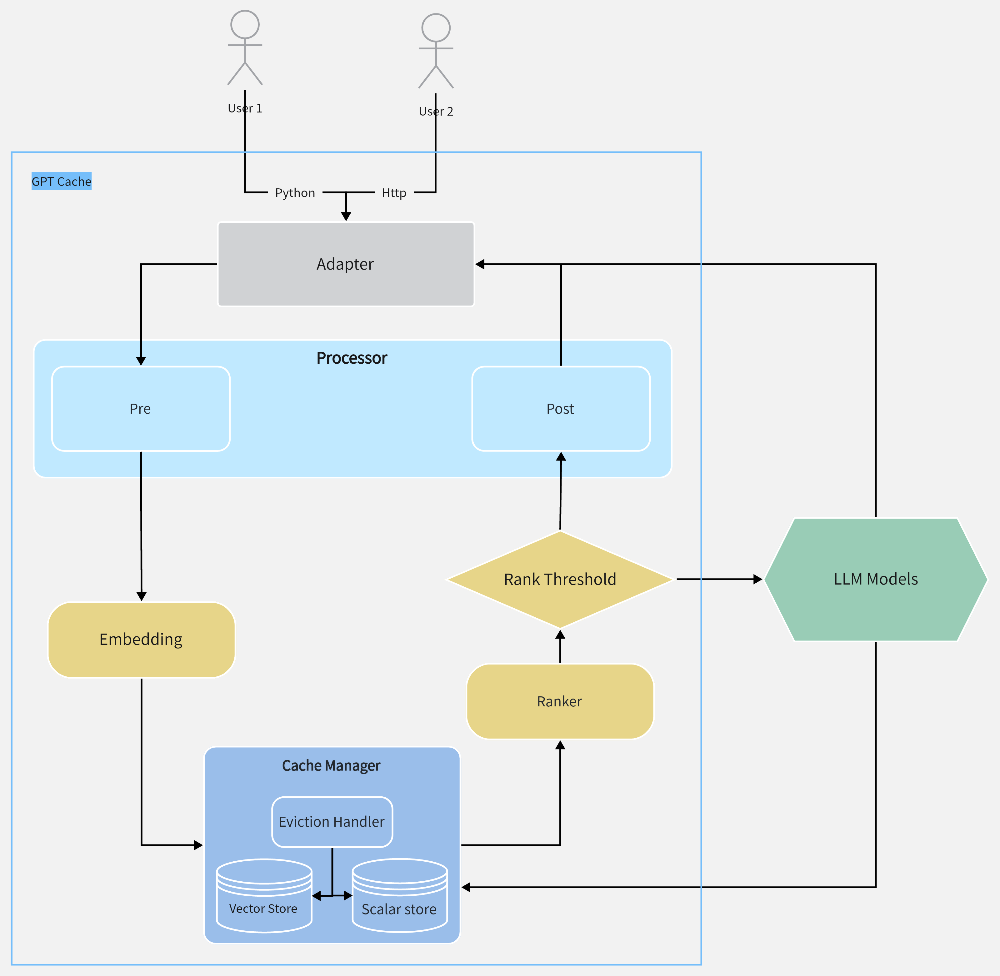

# GPT Cache

English | [中文](README-CN.md)

## What is GPT Cache?

Large Language Models (LLMs) are a promising and transformative technology that has rapidly advanced in recent years. These models are capable of generating natural language text and have numerous applications, including chatbots, language translation, and creative writing. However, as the size of these models increases, so do the costs and performance requirements needed to utilize them effectively. This has led to significant challenges in developing on top of large models such as ChatGPT.

To address this issue, we have developed GPT Cache, a project that focuses on caching responses from language models, also known as a semantic cache. The system offers two major benefits:

1. Quick response to user requests: the caching system provides faster response times compared to large model inference, resulting in lower latency and faster response to user requests.
2. Reduced service costs: most ChatGPT services are currently charged based on the number of requests. If user requests hit the cache, it can reduce the number of requests and lower service costs.

If you find this idea helpful, please consider giving me a star 🌟, as it helps me as well.

## 🤔 Why would GPT Cache be helpful?

I believe it would be necessary for the following reasons:

- Locality is present everywhere. Like traditional application systems, AIGC applications also face similar hot topics. For instance, ChatGPT itself may be a popular topic among programmers.
- For purpose-built SaaS services, users tend to ask questions within a specific domain, with both temporal and spatial locality.
- By utilizing vector similarity search, it is possible to find a similarity relationship between questions and answers at a relatively low cost.

We also provide [benchmarks](https://github.com/zilliztech/gpt-cache/blob/main/example/benchmark/benchmark_sqlite_faiss_towhee.py) to illustrate the concept. In semantic caching, there are three key measurement dimensions: false positives, false negatives, and hit latency. With the plugin-style implementation, users can easily tradeoff these three measurements according to their needs.

## 😊 Quickly Start

**Note**:
- You can quickly experience the cache, it is worth noting that maybe this is not very **stable**.
- By default, basically **a few** libraries are installed. When you need to use some features, it will **auto install** related libraries.
- If failed to install a library for low pip version, run: `python -m pip install --upgrade pip` 

### pip install

```bash
pip install gpt_cache
```

### dev install

```bash
# clone gpt cache repo
git clone https://github.com/zilliztech/gpt-cache
cd gpt-cache

# install the repo
pip install -r requirements.txt
python setup.py install
```

### quick usage

If you just want to achieve precise matching cache of requests, that is, two identical requests, you **ONLY** need **TWO** steps to access this cache

1. Cache init

```python
from gpt_cache.core import cache

cache.init()
# If you use the `openai.api_key = xxx` to set the api key, you need use `cache.set_openai_key()` to replace it
cache.set_openai_key()
```
2. Replace the original openai package

```python
from gpt_cache.view import openai

# openai requests DON'T need ANY changes
answer = openai.ChatCompletion.create(
    model="gpt-3.5-turbo",
    messages=[
        {"role": "system", "content": "You are a helpful assistant."},
        {"role": "user", "content": "foo"}
    ],
)
```

If you want to experience vector similarity search cache locally, you can use the example [Sqlite + Faiss + Towhee](example/sqlite_faiss_towhee/sqlite_faiss_towhee.py).

More Docs：
- [System Design, how it was constructed](doc/system.md)
- [Features, all features currently supported by the cache](doc/feature.md)
- [Examples, learn better custom caching](example/example.md)


## 🤗 All Model



- Pre-embedding, get the key information in the request
  - get the last message in the request, see: `pre_embedding.py#last_content`
- Embedding, transfer the text to vector for similarity search
  - [x] [towhee](https://towhee.io/), english model: paraphrase-albert-small-v2, chinese model: uer/albert-base-chinese-cluecorpussmall
  - [x] openai embedding api
  - [x] string, nothing change
  - [ ] [cohere](https://docs.cohere.ai/reference/embed) embedding api  
- Cache, data manager, including search, save or evict
  - scalar store
    - [x] [sqlite](https://sqlite.org/docs.html)
    - [ ] [postgresql](https://www.postgresql.org/)
    - [ ] [mysql](https://www.mysql.com/)
  - vector store
    - [x] [milvus](https://milvus.io/)
    - [x] [zilliz cloud](https://cloud.zilliz.com/)
  - vector index
    - [x] [faiss](https://faiss.ai/)
- Similarity Evaluation, judging the quality of cached answers
  - the search distance, see: `simple.py#pair_evaluation`
  - [towhee](https://towhee.io/), roberta_duplicate, precise comparison of problems to problems mode, only support the 512 token
  - string, the cache request and the original request are judged by the exact match of characters
  - np, use the `linalg.norm`
- Post Process, how multiple cached answers are returned to the user
  - choose the most similar
  - choose randomly


## 😆 Contributing

Want to help build GPT Cache? Check out our [contributing documentation](doc/contributing.md).


## 🙏 Thank

Thanks to my colleagues in the company [Zilliz](https://zilliz.com/) for their inspiration and technical support.
