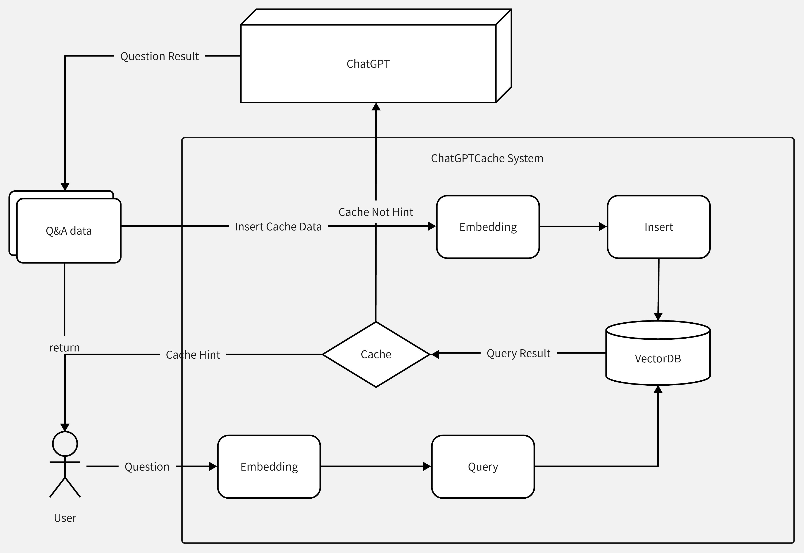

# 系统设计

[English](system.md) | 中文

## 🧐 系统流程

系统的核心流程如上图所示：

1. 用户发送问题，该系统首先进行处理，将问题转换为向量形式进行查询，通过Embedding操作将问题向量化，作为Search操作的输入，在向量数据库中进行查询。
2. 如果查询结果存在，则将相关数据返回给用户。否则，进行下一步操作。
3. 用户请求转发至ChatGPT服务，得到返回数据，发送给用户。
4. 同时，对问答数据进行Embedding操作，将得到的向量插入到向量数据库中，以便用户下次查询时能够快速响应。

## 😵‍💫 系统核心

1. 如何对缓存数据进行**Embedding**操作
这部分涉及到两个问题：初始化数据来源以及数据转换过程的耗时问题。
- 对于不同场景的数据，其差异性很大。如果使用同一数据来源，缓存的命中率将大打折扣。可以采用两种方案：在使用缓存之前进行数据搜集，或者在系统初始阶段，只将数据插入到缓存系统进行Embedding训练。
- 数据转换的时间也是一个重要指标。如果缓存命中，其总体时间应该低于一次大模型推理的时间，否则系统将失去部分优势，影响用户体验。
2. 如何**管理**缓存数据
缓存数据管理的核心流程包括数据写入、搜索和清理。这要求接入的系统需要具备增量索引的能力，例如Milvus，也可以考虑使用轻量级的HNSW索引。数据清理可以保证缓存数据不会无限增长，同时也可以保证缓存查询的效率。
3. 如何**评估**缓存结果
从缓存中获取相应的结果列表后，需要使用模型对结果进行问答相似度匹配。如果相似度达到一定阈值，则直接将该回答返回给用户。否则，将请求转发至ChatGPT。

## 🤩 系统结构

1. 用户层，包装openai接口，包括了：使用openai python和http服务，参考：[api-chat](https://platform.openai.com/docs/api-reference/chat) [guide-chat](https://platform.openai.com/docs/guides/chat/introduction)，
使得用户接入缓存的话，python只需要修改包名，api的话则只需要通过库简单封装成一个http服务即可
2. Embedding层
提取消息中的特征，即将文本转换成向量
3. Cache层
管理缓存数据，包括了：
- 保存标量，向量数据；
- 向量数据搜索；
- 根据搜索结果获取标量数据；
更多：设置缓存数据上限，更新缓存数据
4. 相似评估
对搜索结果进行评估，给出相应的可信度