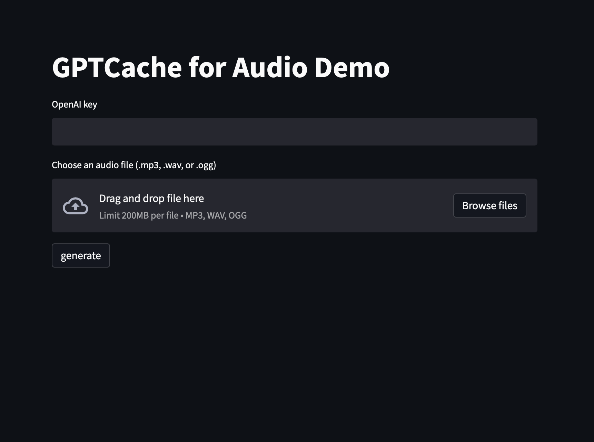

# GPTCache Demo for OpenAI Audio Transcription
This project demonstrates how [GPTcache](https://github.com/zilliztech/GPTCache) can be used to save costs when using OpenAI’s audio transcription API. It provides a simple Streamlit app that allows users to input an audio file and see the corresponding transcribed text. The app uses a cache to store previously generated transcriptions and reuses them for the same audio file, thus avoiding making duplicate API calls.

## Requirements
* Python 3.6 or later 
* Dependencies listed in requirements.txt 
* OpenAI API key
## Usage
1. Clone the repository to your local machine
Install the required packages: pip install -r requirements.txt
2. Run the app: streamlit run audio.py
3. Open the app in your browser at http://localhost:8501
4. Enter your OpenAI API key and upload an audio file to transcribe, then click “generate” to wait for the transcribed text to appear.
If a cache hit occurred, you should see a message like “cache” at the bottom of the transcribed text.

  

