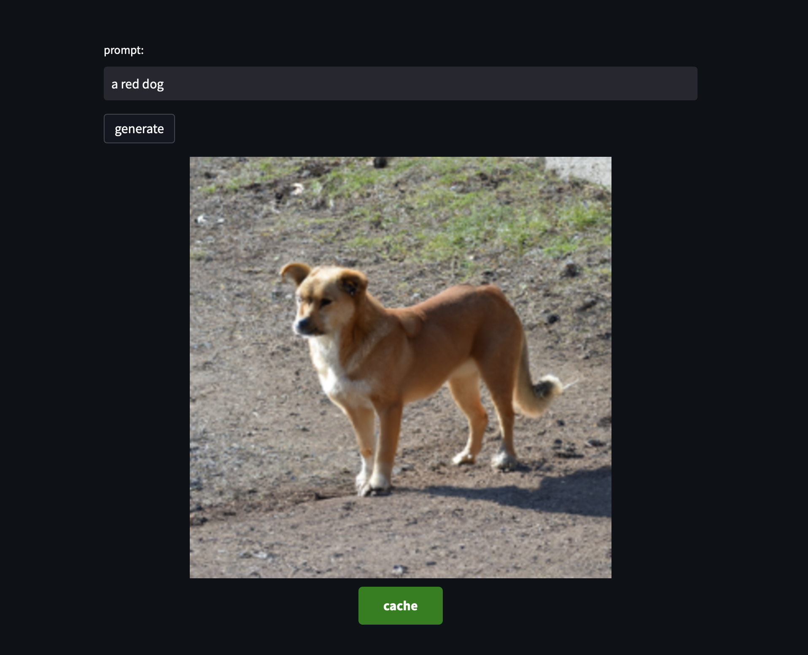

# GPTCache Demo for OpenAI Image Generation
This project demonstrates how [GPTcache](https://github.com/zilliztech/GPTCache) can be used to save costs when using OpenAI’s DALL-E API. It provides a simple Streamlit app that allows users to input a prompt and see the corresponding DALL-E output image. The app uses a cache to store previously generated images and reuses them for the same prompt, thus avoiding making duplicate API calls. There is an online [demo](https://gptcache-openai-image.streamlit.app/) hosted for preview.

## Requirements
* Python 3.6 or later 
* Dependencies listed in requirements.txt 
* OpenAI API key
## Usage
1. Clone the repository to your local machine
Install the required packages: pip install -r requirements.txt
2. Run the app: streamlit run imagen.py
3. Open the app in your browser at http://localhost:8501
4. Enter your OpenAI key and prompt then click “generate” to
wait for the DALL-E output image to appear.
If a cache hit occurred, you should see a message like “cache” at the bottom of the image.

  

