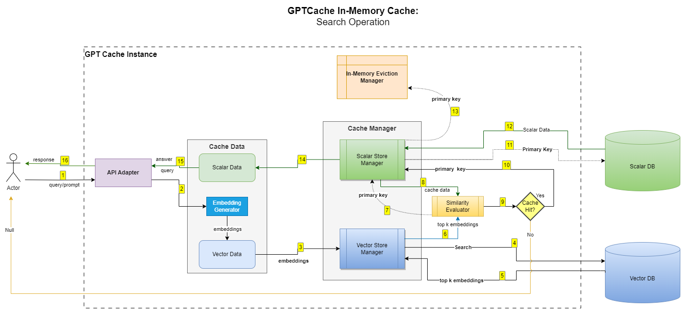
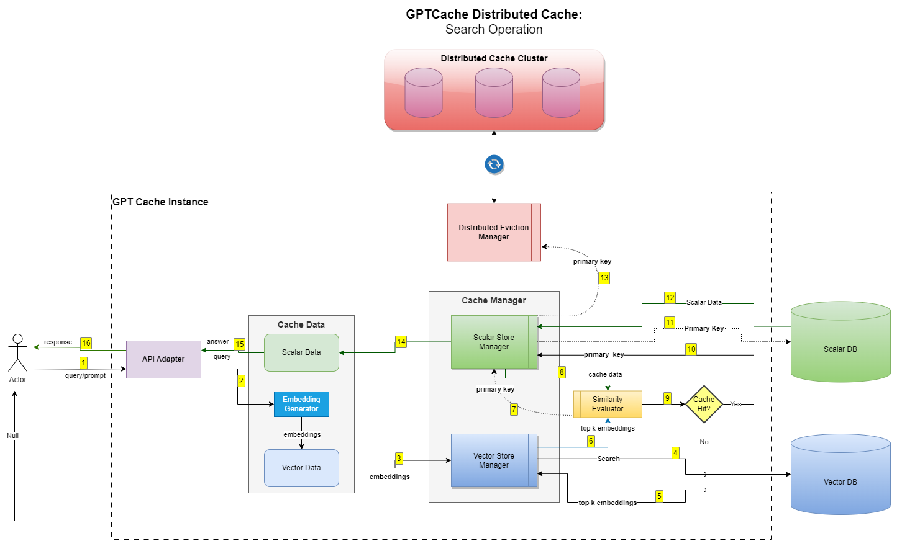
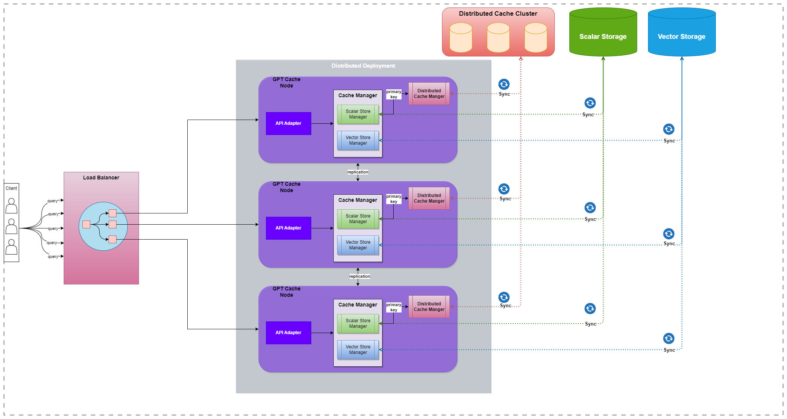

# Horizontal Scaling using Distributed Cache

To see the need for Horizontal scaling of the cache, we need to see how GPTCache works by default, using in-memory cache.
Let's look at a high level break down of the steps involved. More detailed flow is in the diagram below.
## GPTCache In-Memory Search

Above diagram depicts how for a given query search operation will determine whether cache exists or not. 
It happens in following steps: 
1. Accept query from user
2. **Embedding Conversion:** User query is converted into embeddings 
3. **Vector DB Search:** For a given input embedding, top k most similar embeddings are searched in the Vector DB. 
4. **Similarity Evaluation:** For each of the top k embeddings, similarity is evaluated with existing cache data.
5. **Cache Data Search:** After similarity evaluation, cache information for vector embedding with the highest similarity score is searched in the cache. Using the associated Primary Key
   Cache information is stored in two ways. 
   1. **In-memory Eviction Manager:** In-memory Eviction Manger maintains the primary keys of the available cache and oversees the eviction of cache data.  
   2. **Scalar Database:** Scalar DB stores information such as Answers, Dependencies and other metadata.
6. **Cache Data Retrieval:** Once cache data is found, it is retrieved from Scalar DB and returned to the user.

## GPTCache Distributed Cache Search

Although, In-memory eviction manager work great for a single node deployment. It won't work in a multi-node deployment scenario since, cache information is not shared across nodes.  
In the diagrams above, you can observe that the only difference between the two flows is the Eviction Manager. 
The **Distributed Eviction Manager** uses Distributed Cache database such as **Redis** to maintain cache information.

Now that the cache is maintained in a distributed manner, the cache information is shared, and it can be made available across all nodes. This allows a multi-node GPTCache deployment to scale horizontally.


## Horizontal Scaling
The diagram below depicts how a multi-node GPTCache deployment can be configured to enable horizontal scaling.


## Example 
### GPTCache Usage Example
Following example shows how to use GPTCache with `redis` as eviction manager.
 
```python
from gptcache import Cache
from gptcache.embedding import Onnx

from gptcache.manager import manager_factory

onnx = Onnx()
data_manager = manager_factory("redis,faiss",
                               eviction_manager="redis",
                               scalar_params={"url": "redis://localhost:6379"},
                               vector_params={"dimension": onnx.dimension},
                               eviction_params={"maxmemory": "100mb",
                                                "policy": "allkeys-lru",
                                                "ttl": 1}
                               )

cache = Cache()
cache.init(data_manager=data_manager)
question = "What is github?"
answer = "Online platform for version control and code collaboration."
embedding = onnx.to_embeddings(question)
cache.import_data([question], [answer], [embedding])
```
GPTCache-Server can be configured in similar way using YAML configuration.