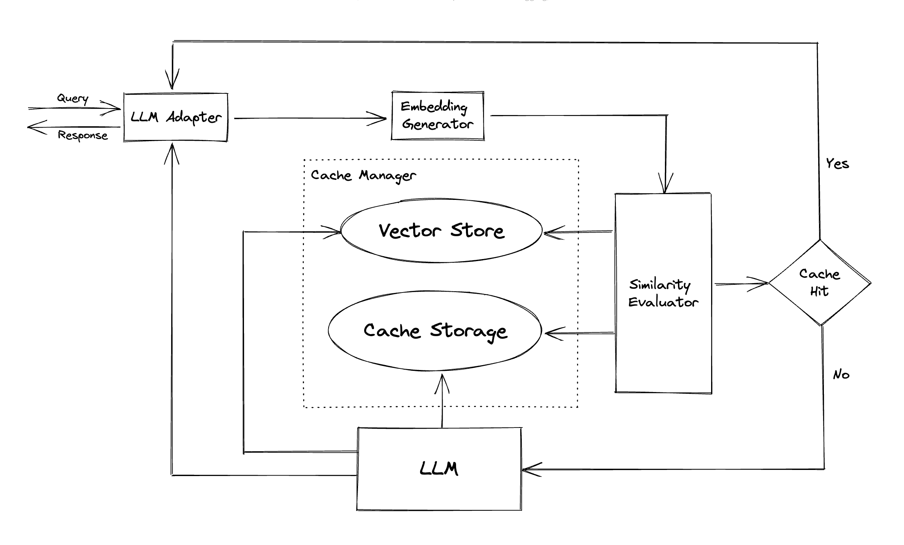

GPTCache : A Library for Creating Semantic Cache for LLM Queries
================================================================

Slash Your LLM API Costs by 10x 💰, Boost Speed by 100x ⚡ 

.. image:: https://img.shields.io/pypi/v/gptcache?label=Release&color&logo=Python
   :target: https://pypi.org/project/gptcache/
   :alt: Release

.. image:: https://img.shields.io/pypi/dm/gptcache.svg?color=bright-green&logo=Pypi
   :target: https://pypi.org/project/gptcache/
   :alt: pip download

.. image:: https://img.shields.io/codecov/c/github/zilliztech/GPTCache/dev?label=Codecov&logo=codecov&token=E30WxqBeJJ
   :target: https://codecov.io/gh/zilliztech/GPTCache
   :alt: Codecov

.. image:: https://img.shields.io/badge/License-MIT-blue.svg
   :target: https://opensource.org/license/mit/
   :alt: License

.. image:: https://img.shields.io/twitter/url/https/twitter.com/zilliz_universe.svg?style=social&label=Follow%20%40Zilliz
   :target: https://twitter.com/zilliz_universe
   :alt: Twitter

.. image:: https://img.shields.io/discord/1092648432495251507?label=Discord&logo=discord
   :target: https://discord.gg/Q8C6WEjSWV
   :alt: Discord

🎉 GPTCache has been fully integrated with 🦜️🔗\ `LangChain <https://github.com/hwchase17/langchain>`_ ! Here are detailed `usage instructions <https://python.langchain.com/en/latest/modules/models/llms/examples/llm_caching.html?highlight=cache#gptcache>`_.

🐳 `The GPTCache server docker image <https://github.com/zilliztech/GPTCache/blob/main/docs/usage.md#Use-GPTCache-server>`_ has been released, which means that **any language** will be able to use GPTCache!

📔 This project is undergoing swift development, and as such, the API may be subject to change at any time. For the most up-to-date information, please refer to the latest `documentation <https://gptcache.readthedocs.io/en/latest/>`_ and `release note <https://github.com/zilliztech/GPTCache/blob/main/docs/release_note.html>`_.

Quick Install
-------------

``pip install gptcache``

🚀 What is GPTCache?
--------------------

ChatGPT and various large language models (LLMs) boast incredible versatility, enabling the development of a wide range of applications. However, as your application grows in popularity and encounters higher traffic levels, the expenses related to LLM API calls can become substantial. Additionally, LLM services might exhibit slow response times, especially when dealing with a significant number of requests.

To tackle this challenge, we have created GPTCache, a project dedicated to building a semantic cache for storing LLM responses. 

😊 Quick Start
--------------

**Note**\ :

* You can quickly try GPTCache and put it into a production environment without heavy development. However, please note that the repository is still under heavy development.
* By default, only a limited number of libraries are installed to support the basic cache functionalities. When you need to use additional features, the related libraries will be **automatically installed**.
* Make sure that the Python version is **3.8.1 or higher**\ , check: ``python --version``
* If you encounter issues installing a library due to a low pip version, run: ``python -m pip install --upgrade pip``.

dev install
^^^^^^^^^^^

.. code-block:: bash

   # clone GPTCache repo
   git clone -b dev https://github.com/zilliztech/GPTCache.git
   cd GPTCache

   # install the repo
   pip install -r requirements.txt
   python setup.py install

example usage
^^^^^^^^^^^^^

These examples will help you understand how to use exact and similar matching with caching. You can also run the example on `Colab <https://colab.research.google.com/drive/1m1s-iTDfLDk-UwUAQ_L8j1C-gzkcr2Sk?usp=share_link>`_. And more examples you can refer to the `Bootcamp <https://gptcache.readthedocs.io/en/latest/bootcamp/openai/chat.html>`_

Before running the example, **make sure** the OPENAI_API_KEY environment variable is set by executing ``echo $OPENAI_API_KEY``. 

If it is not already set, it can be set by using ``export OPENAI_API_KEY=YOUR_API_KEY`` on Unix/Linux/MacOS systems or ``set OPENAI_API_KEY=YOUR_API_KEY`` on Windows systems. 

..

   It is important to note that this method is only effective temporarily, so if you want a permanent effect, you'll need to modify the environment variable configuration file. For instance, on a Mac, you can modify the file located at ``/etc/profile``.

.. collapse:: Click to SHOW examples

    
    **OpenAI API original usage**
    
    .. code-block:: python
    
       import os
       import time
    
       import openai
    
    
       def response_text(openai_resp):
           return openai_resp['choices'][0]['message']['content']
    
    
       question = 'what‘s chatgpt'
    
       **OpenAI API original usage**
       openai.api_key = os.getenv("OPENAI_API_KEY")
       start_time = time.time()
       response = openai.ChatCompletion.create(
         model='gpt-3.5-turbo',
         messages=[
           {
               'role': 'user',
               'content': question
           }
         ],
       )
       print(f'Question: {question}')
       print("Time consuming: {:.2f}s".format(time.time() - start_time))
       print(f'Answer: {response_text(response)}\n')
    
    **OpenAI API + GPTCache, exact match cache**
    
    ..
    
       If you ask ChatGPT the exact same two questions, the answer to the second question will be obtained from the cache without requesting ChatGPT again.
    
    
    .. code-block:: python
    
       import time
    
    
       def response_text(openai_resp):
           return openai_resp['choices'][0]['message']['content']
    
       print("Cache loading.....")
    
       **To use GPTCache, that's all you need**
       **-------------------------------------------------**
       from gptcache import cache
       from gptcache.adapter import openai
    
       cache.init()
       cache.set_openai_key()
       **-------------------------------------------------**
    
       question = "what's github"
       for _ in range(2):
           start_time = time.time()
           response = openai.ChatCompletion.create(
             model='gpt-3.5-turbo',
             messages=[
               {
                   'role': 'user',
                   'content': question
               }
             ],
           )
           print(f'Question: {question}')
           print("Time consuming: {:.2f}s".format(time.time() - start_time))
           print(f'Answer: {response_text(response)}\n')
    
    **OpenAI API + GPTCache, similar search cache**
    
    ..
    
       After obtaining an answer from ChatGPT in response to several similar questions, the answers to subsequent questions can be retrieved from the cache without the need to request ChatGPT again.
    
    
    .. code-block:: python
    
       import time
    
    
       def response_text(openai_resp):
           return openai_resp['choices'][0]['message']['content']
    
       from gptcache import cache
       from gptcache.adapter import openai
       from gptcache.embedding import Onnx
       from gptcache.manager import CacheBase, VectorBase, get_data_manager
       from gptcache.similarity_evaluation.distance import SearchDistanceEvaluation
    
       print("Cache loading.....")
    
       onnx = Onnx()
       data_manager = get_data_manager(CacheBase("sqlite"), VectorBase("faiss", dimension=onnx.dimension))
       cache.init(
           embedding_func=onnx.to_embeddings,
           data_manager=data_manager,
           similarity_evaluation=SearchDistanceEvaluation(),
           )
       cache.set_openai_key()
    
       questions = [
           "what's github",
           "can you explain what GitHub is",
           "can you tell me more about GitHub"
           "what is the purpose of GitHub"
       ]
    
       for question in questions:
           start_time = time.time()
           response = openai.ChatCompletion.create(
               model='gpt-3.5-turbo',
               messages=[
                   {
                       'role': 'user',
                       'content': question
                   }
               ],
           )
           print(f'Question: {question}')
           print("Time consuming: {:.2f}s".format(time.time() - start_time))
           print(f'Answer: {response_text(response)}\n')
    
    **OpenAI API + GPTCache, use temperature**
    
    ..
    
       You can always pass a parameter of temperature while requesting the API service or model.
    
       The range of ``temperature`` is [0, 2], default value is 0.0.
    
       A higher temperature means a higher possibility of skipping cache search and requesting large model directly.
       When temperature is 2, it will skip cache and send request to large model directly for sure. When temperature is 0, it will search cache before requesting large model service.
    
       The default ``post_process_messages_func`` is ``temperature_softmax``. In this case, refer to `API reference <https://gptcache.readthedocs.io/en/latest/references/processor.html#module-gptcache.processor.post>`_ to learn about how ``temperature`` affects output.
    
    
    .. code-block:: python
    
       import time
    
       from gptcache import cache, Config
       from gptcache.manager import manager_factory
       from gptcache.embedding import Onnx
       from gptcache.processor.post import temperature_softmax
       from gptcache.similarity_evaluation.distance import SearchDistanceEvaluation
       from gptcache.adapter import openai
    
       cache.set_openai_key()
    
       onnx = Onnx()
       data_manager = manager_factory("sqlite,faiss", vector_params={"dimension": onnx.dimension})
    
       cache.init(
           embedding_func=onnx.to_embeddings,
           data_manager=data_manager,
           similarity_evaluation=SearchDistanceEvaluation(),
           post_process_messages_func=temperature_softmax
           )
       **cache.config = Config(similarity_threshold=0.2)**
    
       question = "what's github"
    
       for _ in range(3):
           start = time.time()
           response = openai.ChatCompletion.create(
               model="gpt-3.5-turbo",
       **Change temperature here**
               messages=[{
                   "role": "user",
                   "content": question
               }],
           )
           print("Time elapsed:", round(time.time() - start, 3))
           print("Answer:", response["choices"][0]["message"]["content"])
    
To use GPTCache exclusively, only the following lines of code are required, and there is no need to modify any existing code.

.. code-block:: python

   from gptcache import cache
   from gptcache.adapter import openai

   cache.init()
   cache.set_openai_key()

More Docs：

* `Usage, how to use GPTCache better <usage.html>`_
* `Features, all features currently supported by the cache <feature.html>`_
* `Examples, learn better custom caching <examples/README.html>`_

🎓 Bootcamp
-----------

* GPTCache with **LangChain**

  * `QA Generation <https://gptcache.readthedocs.io/en/latest/bootcamp/langchain/qa_generation.html>`_
  * `Question Answering <https://gptcache.readthedocs.io/en/latest/bootcamp/langchain/question_answering.html>`_
  * `SQL Chain <https://gptcache.readthedocs.io/en/latest/bootcamp/langchain/sqlite.html>`_
  * `BabyAGI User Guide <https://gptcache.readthedocs.io/en/latest/bootcamp/langchain/baby_agi.html>`_

* GPTCache with **OpenAI**

  * `Chat completion <https://gptcache.readthedocs.io/en/latest/bootcamp/openai/chat.html>`_
  * `Language Translation <https://gptcache.readthedocs.io/en/latest/bootcamp/openai/language_translate.html>`_
  * `SQL Translate <https://gptcache.readthedocs.io/en/latest/bootcamp/openai/sql_translate.html>`_
  * `Multimodal: Image Generation <https://gptcache.readthedocs.io/en/latest/bootcamp/openai/image_generation.html>`_
  * `Multimodal: Speech to Text <https://gptcache.readthedocs.io/en/latest/bootcamp/openai/speech_to_text.html>`_

* GPTCache with **Replicate**

  * `Visual Question Answering <https://gptcache.readthedocs.io/en/latest/bootcamp/replicate/visual_question_answering.html>`_

* GPTCache with **Temperature Param**

  * `OpenAI Chat <https://gptcache.readthedocs.io/en/latest/bootcamp/temperature/chat.html>`_
  * `OpenAI Image Creation <https://gptcache.readthedocs.io/en/latest/bootcamp/temperature/create_image.html>`_

😎 What can this help with?
---------------------------

GPTCache offers the following primary benefits:

* **Decreased expenses**\ : Most LLM services charge fees based on a combination of number of requests and `token count <https://openai.com/pricing>`_. GPTCache effectively minimizes your expenses by caching query results, which in turn reduces the number of requests and tokens sent to the LLM service. As a result, you can enjoy a more cost-efficient experience when using the service.
* **Enhanced performance**\ : LLMs employ generative AI algorithms to generate responses in real-time, a process that can sometimes be time-consuming. However, when a similar query is cached, the response time significantly improves, as the result is fetched directly from the cache, eliminating the need to interact with the LLM service. In most situations, GPTCache can also provide superior query throughput compared to standard LLM services.
* **Adaptable development and testing environment**\ : As a developer working on LLM applications, you're aware that connecting to LLM APIs is generally necessary, and comprehensive testing of your application is crucial before moving it to a production environment. GPTCache provides an interface that mirrors LLM APIs and accommodates storage of both LLM-generated and mocked data. This feature enables you to effortlessly develop and test your application, eliminating the need to connect to the LLM service.
* **Improved scalability and availability**\ : LLM services frequently enforce `rate limits <https://platform.openai.com/docs/guides/rate-limits>`_\ , which are constraints that APIs place on the number of times a user or client can access the server within a given timeframe. Hitting a rate limit means that additional requests will be blocked until a certain period has elapsed, leading to a service outage. With GPTCache, you can easily scale to accommodate an increasing volume of of queries, ensuring consistent performance as your application's user base expands.

🤔 How does it work?
--------------------

Online services often exhibit data locality, with users frequently accessing popular or trending content. Cache systems take advantage of this behavior by storing commonly accessed data, which in turn reduces data retrieval time, improves response times, and eases the burden on backend servers. Traditional cache systems typically utilize an exact match between a new query and a cached query to determine if the requested content is available in the cache before fetching the data.

However, using an exact match approach for LLM caches is less effective due to the complexity and variability of LLM queries, resulting in a low cache hit rate. To address this issue, GPTCache adopt alternative strategies like semantic caching. Semantic caching identifies and stores similar or related queries, thereby increasing cache hit probability and enhancing overall caching efficiency. 

GPTCache employs embedding algorithms to convert queries into embeddings and uses a vector store for similarity search on these embeddings. This process allows GPTCache to identify and retrieve similar or related queries from the cache storage, as illustrated in the `Modules section <https://github.com/zilliztech/GPTCache#-modules>`_. 

Featuring a modular design, GPTCache makes it easy for users to customize their own semantic cache. The system offers various implementations for each module, and users can even develop their own implementations to suit their specific needs.

In a semantic cache, you may encounter false positives during cache hits and false negatives during cache misses. GPTCache offers three metrics to gauge its performance, which are helpful for developers to optimize their caching systems:

* **Hit Ratio**\ : This metric quantifies the cache's ability to fulfill content requests successfully, compared to the total number of requests it receives. A higher hit ratio indicates a more effective cache.
* **Latency**\ : This metric measures the time it takes for a query to be processed and the corresponding data to be retrieved from the cache. Lower latency signifies a more efficient and responsive caching system.
* **Recall**\ : This metric represents the proportion of queries served by the cache out of the total number of queries that should have been served by the cache. Higher recall percentages indicate that the cache is effectively serving the appropriate content.

A `sample benchmark <https://github.com/zilliztech/gpt-cache/blob/main/examples/benchmark/benchmark_sqlite_faiss_onnx.py>`_ is included for users to start with assessing the performance of their semantic cache.

🤗 Modules
----------

* **LLM Adapter**\ : 
  The LLM Adapter is designed to integrate different LLM models by unifying their APIs and request protocols. GPTCache offers a standardized interface for this purpose, with current support for ChatGPT integration.

  * [x] Support OpenAI ChatGPT API.
  * [x] Support `langchain <https://github.com/hwchase17/langchain>`_.
  * [x] Support `minigpt4 <https://github.com/Vision-CAIR/MiniGPT-4.git>`_.
  * [x] Support `Llamacpp <https://github.com/ggerganov/llama.cpp.git>`_.
  * [x] Support `dolly <https://github.com/databrickslabs/dolly.git>`_.
  * [ ] Support other LLMs, such as Hugging Face Hub, Bard, Anthropic.

* **Multimodal Adapter (experimental)**\ : 
  The Multimodal Adapter is designed to integrate different large multimodal models by unifying their APIs and request protocols. GPTCache offers a standardized interface for this purpose, with current support for integrations of image generation, audio transcription.

  * [x] Support OpenAI Image Create API.
  * [x] Support OpenAI Audio Transcribe API.
  * [x] Support Replicate BLIP API.
  * [x] Support Stability Inference API.
  * [x] Support Hugging Face Stable Diffusion Pipeline (local inference).
  * [ ] Support other multimodal services or self-hosted large multimodal models.

* **Embedding Generator**\ : 
  This module is created to extract embeddings from requests for similarity search. GPTCache offers a generic interface that supports multiple embedding APIs, and presents a range of solutions to choose from. 

  * [x] Disable embedding. This will turn GPTCache into a keyword-matching cache.
  * [x] Support OpenAI embedding API.
  * [x] Support `ONNX <https://onnx.ai/>`_ with the GPTCache/paraphrase-albert-onnx model.
  * [x] Support `Hugging Face <https://huggingface.co/>`_ embedding with transformers, ViTModel, Data2VecAudio.
  * [x] Support `Cohere <https://docs.cohere.ai/reference/embed>`_ embedding API.
  * [x] Support `fastText <https://fasttext.cc>`_ embedding.
  * [x] Support `SentenceTransformers <https://www.sbert.net>`_ embedding.
  * [x] Support `Timm <https://timm.fast.ai/>`_ models for image embedding.
  * [ ] Support other embedding APIs.

* **Cache Storage**\ :
  **Cache Storage** is where the response from LLMs, such as ChatGPT, is stored. Cached responses are retrieved to assist in evaluating similarity and are returned to the requester if there is a good semantic match. At present, GPTCache supports SQLite and offers a universally accessible interface for extension of this module.

  * [x] Support `SQLite <https://sqlite.org/docs.html>`_.
  * [x] Support `DuckDB <https://duckdb.org/>`_.
  * [x] Support `PostgreSQL <https://www.postgresql.org/>`_.
  * [x] Support `MySQL <https://www.mysql.com/>`_.
  * [x] Support `MariaDB <https://mariadb.org/>`_.
  * [x] Support `SQL Server <https://www.microsoft.com/en-us/sql-server/>`_.
  * [x] Support `Oracle <https://www.oracle.com/>`_.
  * [x] Support `Duckdb <https://github.com/duckdb/duckdb>`_.
  * [ ] Support `MongoDB <https://www.mongodb.com/>`_.
  * [ ] Support `Redis <https://redis.io/>`_.
  * [ ] Support `Minio <https://min.io/>`_.
  * [ ] Support `HBase <https://hbase.apache.org/>`_.
  * [ ] Support `ElasticSearch <https://www.elastic.co/>`_.
  * [ ] Support other storages.

* **Vector Store**\ :
  The **Vector Store** module helps find the K most similar requests from the input request's extracted embedding. The results can help assess similarity. GPTCache provides a user-friendly interface that supports various vector stores, including Milvus, Zilliz Cloud, and FAISS. More options will be available in the future.

  * [x] Support `Milvus <https://milvus.io/>`_\ , an open-source vector database for production-ready AI/LLM applicaionts. 
  * [x] Support `Zilliz Cloud <https://cloud.zilliz.com/>`_\ , a fully-managed cloud vector database based on Milvus.
  * [x] Support `Milvus Lite <https://github.com/milvus-io/milvus-lite>`_\ , a lightweight version of Milvus that can be embedded into your Python application.
  * [x] Support `FAISS <https://faiss.ai/>`_\ , a library for efficient similarity search and clustering of dense vectors.
  * [x] Support `Hnswlib <https://github.com/nmslib/hnswlib>`_\ , header-only C++/python library for fast approximate nearest neighbors.
  * [x] Support `pgvector <https://github.com/pgvector/pgvector>`_\ , open-source vector similarity search for Postgres.
  * [x] Support `chroma <https://github.com/chroma-core/chroma>`_\ , the AI-native open-source embedding database.
  * [ ] Support qdrant
  * [ ] Support weaviate
  * [ ] Support other vector databases.

* **Cache Manager**\ :
  The **Cache Manager** is responsible for controlling the operation of both the **Cache Storage** and **Vector Store**.

  * **Eviction Policy**\ :
    Currently, GPTCache makes decisions about evictions based solely on the number of lines. This approach can result in inaccurate resource evaluation and may cause out-of-memory (OOM) errors. We are actively investigating and developing a more sophisticated strategy.

    * [x] Support LRU eviction policy.
    * [x] Support FIFO eviction policy.
    * [ ] Support more complicated eviction policies.

* **Similarity Evaluator**\ : 
  This module collects data from both the **Cache Storage** and **Vector Store**\ , and uses various strategies to determine the similarity between the input request and the requests from the **Vector Store**. Based on this similarity, it determines whether a request matches the cache. GPTCache provides a standardized interface for integrating various strategies, along with a collection of implementations to use. The following similarity definitions are currently supported or will be supported in the future:

  * [x] The distance we obtain from the **Vector Store**.
  * [x] A model-based similarity determined using the GPTCache/albert-duplicate-onnx model from `ONNX <https://onnx.ai/>`_.
  * [x] Exact matches between the input request and the requests obtained from the **Vector Store**.
  * [x] Distance represented by applying linalg.norm from numpy to the embeddings.
  * [ ] BM25 and other similarity measurements.
  * [ ] Support other model serving framework such as PyTorch.

  **Note**\ :Not all combinations of different modules may be compatible with each other. For instance, if we disable the **Embedding Extractor**\ , the **Vector Store** may not function as intended. We are currently working on implementing a combination sanity check for **GPTCache**.

😇 Roadmap
----------

Coming soon! `Stay tuned! <https://twitter.com/zilliz_universe>`_

😍 Contributing
---------------

We are extremely open to contributions, be it through new features, enhanced infrastructure, or improved documentation.

For comprehensive instructions on how to contribute, please refer to our `contribution guide <contributing.html>`_.

.. toctree::
   :maxdepth: 1
   :caption: Getting Started
   :name: getting-started
   :hidden:

   usage.md
   feature.md
   release_note.md

.. toctree::
   :maxdepth: 1
   :caption: Bootcamp
   :name: bootcamp
   :hidden:

   bootcamp/langchain/index
   bootcamp/openai/index
   bootcamp/replicate/index
   bootcamp/temperature/index

.. toctree::
   :maxdepth: 1
   :caption: References
   :name: references
   :hidden:

   references/index

.. toctree::
   :maxdepth: 1
   :caption: Contributing
   :name: contributing
   :hidden:

   contributing.md