# Semantic Ghost Lists

### Reviving Adaptive Cache Replacement in an LLM Semantic Cache

**Guy Shindel** · Baseline framework: [GPTCache](https://github.com/zilliztech/GPTCache) · Branch: `feature/semantic-arc`

---

> **In one paragraph.** Every modern cache replacement policy that beats LRU does so by
> remembering things about entries it has already evicted. That memory is keyed by exact item
> identity — a block number, a URL, a row id. In a *semantic* cache the item that comes back is
> not the item that left: it is a paraphrase, a different string with a different row id. So the
> history never matches, and the adaptive machinery that depends on it is silently dead. This
> report shows that failure is real and measurable (ARC's adaptation parameter sits at exactly
> `p = 0.000` for every trace, on every corpus tested), fixes it by keying the history with
> embedding similarity instead of identity, and then measures — honestly, including a memory
> charge that reverses part of the result — exactly where the fix pays for itself.

---

## Table of contents

1. [Introduction](#1-introduction)
2. [Extension design](#2-extension-design)
3. [Experimental setup](#3-experimental-setup)
4. [Results](#4-results)
5. [Discussion](#5-discussion)
6. [Conclusion and future work](#6-conclusion-and-future-work)
- [Appendix A — artifacts and reproduction](#appendix-a--artifacts-and-reproduction)
- [Appendix B — full result tables](#appendix-b--full-result-tables)

---

# 1. Introduction

## 1.1 Problem statement

An LLM call is expensive twice over: hundreds of milliseconds of latency and a per-token bill. A
large fraction of production prompt traffic is repetitive — not byte-identical, but *semantically*
repetitive. "How do I reset my password?" and "password reset — how?" want the same answer.

A **semantic cache** exploits this. It embeds each incoming prompt, searches for a previously
answered prompt within a cosine threshold `tau`, and if it finds one, serves the stored response
instead of calling the model. A hit costs an embedding plus a vector search — microseconds to low
milliseconds — against hundreds of milliseconds for the model.

Any cache is bounded, so every miss forces an eviction, and **which entry gets evicted decides the
hit rate**. This is the classic replacement problem, but on a workload the replacement literature
has never targeted: one where identity is fuzzy.

## 1.2 Choice of baseline framework

**GPTCache** (zilliztech, ~7.5k stars, Apache-2.0) was selected. The criteria and how it scores:

| Criterion | GPTCache |
|---|---|
| **Maturity** | The de-facto open-source semantic cache for LLMs; packaged on PyPI, LangChain- and LlamaIndex-integrated, actively released (0.1.44 at fork point). |
| **Community** | Real issue traffic and external PRs; a live upstream to contribute back to. |
| **Ease of modification** | Cleanly layered: `Cache` → adapters → `DataManager` → (`CacheStorage`, `VectorStore`, `EvictionBase`). The eviction layer is a small, well-isolated abstract base with a factory — the exact seam this project needed. |
| **Tests & docs** | A real `tests/unit_tests` tree, CI config, and a documentation site. Enough to establish a regression baseline. |
| **Relevance** | It is a *semantic* cache, which is the entire premise of the hypothesis below. |

**Architecture relevant to this work.** `DataManager` owns a scalar store (SQLite by default) and a
vector store (FAISS by default). Eviction is delegated to an `EvictionBase` implementation;
`MemoryCacheEviction` is the in-memory one, and it holds *keys only* — the policy decides which ids
to release, and an `on_evict` callback removes those rows from the two stores. This separation is
what makes a new policy a self-contained addition rather than surgery.

**Default eviction policy: LRU**, via `cachetools.LRUCache`. GPTCache ships four:

| Policy | Backing |
|---|---|
| **LRU** (default) | `cachetools.LRUCache` |
| LFU | `cachetools.LFUCache` |
| FIFO | `cachetools.FIFOCache` |
| RR | `cachetools.RRCache` |

All four are thin delegations. Two details of the shipped implementation matter later and are
controlled for in §3.6: evictions happen in **batches** of `clean_size = 0.2 × maxsize`, and
`cachetools.RRCache` selects its victim from the *unseeded global* `random`, making it
non-reproducible across runs.

**What GPTCache does not have:** any policy that keeps state about entries it has evicted. That is
the gap this work fills.

## 1.3 Related work

- **ARC** (Megiddo & Modha, FAST 2003) splits the cache into a recency list `T1` and a frequency
  list `T2`, and keeps two **ghost lists** `B1`/`B2` — the identities of recently evicted entries,
  holding *no* cached payload. A request that misses in the cache but hits a ghost is proof that the
  eviction was a mistake, and tells ARC which way to move its recency/frequency boundary `p`. It is
  self-tuning: no workload-specific knob.
- **TinyLFU** (Einziger & Friedman, PDP 2014; ACM TOS 2017) keeps a frequency sketch over items it
  has seen, resident or not, and uses it as an *admission* filter. It is the policy behind Caffeine.
- Both — and every ghost-list or sketch-based policy in the literature — key their history **by
  exact item identity**. This is correct and unremarkable for a block cache or a CDN, where the same
  block number or URL genuinely returns.

## 1.4 Contributions

1. **A diagnosis.** Exact-identity history is *inert* on semantic workloads. Demonstrated twice,
   independently: an exact-key frequency sketch's estimates correlate with true popularity at
   **r = −0.037**, and classic ARC's adaptation parameter holds at **exactly `p = 0.000`** across
   every trace of every corpus tested. Classic ARC on a semantic cache is not merely suboptimal —
   its defining mechanism never fires.
2. **A fix.** `ARCCache` (`gptcache/manager/eviction/arc.py`), a new GPTCache eviction policy whose
   ghost membership test is nearest-neighbour under cosine similarity rather than dictionary
   lookup. One method differs from the 2003 paper.
3. **An ablation that is a single constructor flag.** `ghost_matching="exact"` reproduces classic
   ARC and its failure mode exactly, in the same code, so the mechanism claim is isolated rather
   than argued.
4. **A bounded, honest evaluation.** 5,520-cell parameter sweep with paired-bootstrap confidence
   intervals, false-hit-rate (correctness-of-answer) measurement, a real-arrival-order trace, an
   **iso-memory** comparison that charges ARC for the memory its ghosts consume — which reverses
   the verdict in part of the space — and a documented failure of the study's own predictive rule to
   transfer to real traffic.

---

# 2. Extension design

## 2.1 Motivation: the hypothesis, stated so it can fail

GPTCache assigns a **fresh row id on every miss**. A paraphrase of an evicted question therefore
arrives as a new string with a new id. A ghost list keyed by id can never match it. So:

> **Thesis.** In a semantic cache, history keyed by exact identity can never fire, and the adaptive
> machinery that depends on it is inert. Keying that history by embedding similarity restores it.

Two falsifiable predictions:

- **P1.** Classic ARC's `p` never moves from its initial value over an entire trace, and ARC
  degrades to approximately LRU.
- **P2.** An exact-key frequency sketch carries no signal — its estimates are uncorrelated with true
  query popularity.

P2 is deliberately a claim about *keying*, not about TinyLFU as an algorithm.

**Alternatives considered and rejected before implementation** (recorded in `resources/RESULTS.md`):
cost-aware eviction (GDSF) and W-TinyLFU + cost admission were already open PRs by classmates;
"approximate matching" *is* GPTCache, not an extension to it; a coverage/redundancy-based eviction
policy was prototyped in simulation and **lost to LRU by 5.9 pp**, so it was dropped.

## 2.2 Screening before building

Both predictions were tested on real embeddings **before any policy code was written**, as a
pass/fail gate (`benchmarks/gate_screening.py`). The point was to make the project falsifiable while
abandoning it was still cheap.

**Gate 1 — are exact-key sketches inert?** Correlation between sketch estimate and true cluster
popularity. Pass condition: `|r_exact| < 0.15`.

| keying | mean estimate | max estimate | corr. with true popularity |
|---|---|---|---|
| exact key | 0.20 | 2 | **−0.037** |
| LSH (12 bits × 16 tables) | 2.15 | 7 | **+0.931** |

Passed. An exact-key counter almost never sees the same key twice, so it measures nothing. **P2
confirmed.**

**Gate 2 — do semantic ghosts beat exact ghosts?** Pass condition: every margin ≥ 3 pp.

| trace | cap | LRU | LFU | ARC-exact | ARC-semantic | margin | final `p` (exact / semantic) |
|---|---|---|---|---|---|---|---|
| quora-drift | 100 | 47.90% | 25.42% | 37.05% | **54.31%** | +17.26 pp | 0.0 / 1.0 |
| quora-drift | 400 | 62.00% | 47.21% | 47.05% | **62.20%** | +15.15 pp | 0.0 / 233.8 |
| wildchat | 100 | 28.29% | 12.34% | 16.46% | **28.44%** | +11.98 pp | 0.0 / 56.1 |
| wildchat | 400 | 30.22% | 18.80% | 19.30% | **30.48%** | +11.18 pp | 0.0 / 103.4 |

Passed, worst margin +11.18 pp. The final-`p` column is **P1 confirmed directly**: exact ghosts pin
`p` at 0.0 on every trace.

## 2.3 The policy

**File:** `gptcache/manager/eviction/arc.py` (477 lines). Self-contained — standard library, numpy,
and `EvictionBase`.

**State.**

```
c          capacity (maximum resident entries)
p          float in [0, c] — adaptive target size for T1
T1, T2     resident: seen-once / seen-more-than-once, LRU-ordered
B1, B2     ghost lists: evicted from T1 / T2 — embedding, no response
tau        cosine threshold for a ghost match
```

**Invariants**, asserted by a `check_invariants()` method and re-checked after every operation in
the test suite:

```
|T1| + |T2| <= c                    |T1| + |B1| <= c
|T2| + |B2| <= 2c                   |T1|+|T2|+|B1|+|B2| <= 2c
0 <= p <= c                         |T1|+|T2| < c  =>  B1 and B2 are empty
```

**The contribution, in one method.** Cases I–IV follow Figure 4 of the 2003 paper line for line. The
*only* algorithmic change is the ghost membership test:

```python
def _match(self, ghosts: _VecList, query, key):
    """Ghost membership test -- the semantic modification lives here."""
    if not self._semantic:
        return key if key in ghosts else None      # classic ARC
    if query is None:
        return None
    return ghosts.nearest(query, self._tau)        # nearest ghost, if >= tau
```

Classic ARC asks *"is this id in B1?"*. Semantic ARC asks *"is there a ghost whose embedding is
within `tau` of this query?"*. Everything downstream — the `p` update, `REPLACE`, the four cases —
is unchanged. This is gated behind `ghost_matching="semantic"|"exact"`, and **that flag is the
ablation**.

Resident lookup is deliberately *not* reimplemented here: GPTCache's vector store already finds the
nearest resident entry and calls `get(id)` on a hit. Only the ghosts need their own search.

## 2.4 `_VecList`: making the ghost scan cheap

The obvious implementation keeps `dict[id] -> np.ndarray` and stacks vectors on demand, allocating a
fresh `(n, d)` matrix on every miss. Instead, each of the four ARC lists is a `_VecList`: one
contiguous `float32` matrix plus an insertion-ordered dict for LRU order.

- **Search** is a single BLAS `matvec` over a contiguous block — no Python loop, no per-call
  allocation beyond the score vector. Inputs are unit-norm, so cosine similarity *is* the dot
  product.
- **Removal** is O(1): swap the last row into the vacated slot, fix two index entries.
- **Growth** doubles the backing matrix.

`nearest()` is tested for agreement against a naive scan (`test_nearest_matches_naive_scan`).

## 2.5 API compatibility and tunables

Four small, backward-compatible edits. **No existing policy code path was modified.**

| File | Change |
|---|---|
| `eviction/base.py` | `put(objs)` → `put(objs, embeddings=None)`. Optional and defaulted, so every existing implementation and caller is unaffected. |
| `eviction/memory_cache.py` | One `elif self._policy == "ARC"` branch. ARC is deliberately **not** wrapped in `popitem_wrapper` — that wrapper adapts cachetools; ARC evicts itself and reports through `on_evict` directly. |
| `manager/factory.py` | Threads an `eviction_params` dict through so `tau` / `ghost_matching` reach the policy. |
| `manager/data_manager.py` | Passes the already-normalised `embedding_datas` to `put()`. Every non-ARC policy ignores the kwarg. |

**Usage** — one string changes:

```python
data_manager = get_data_manager(
    CacheBase("sqlite"), VectorBase("faiss", dimension=384),
    max_size=1000,
    eviction="ARC",                                    # was "LRU"
    eviction_params={"tau": 0.8, "ghost_matching": "semantic"},
)
```

**Tunables:**

| Parameter | Default | Meaning | Effect (measured) |
|---|---|---|---|
| `maxsize` | 1000 | resident entries | Dominant term. ARC's margin over LRU falls monotonically as capacity rises (§4.5). |
| `tau` | 0.8 | cosine threshold for a **ghost** match | Below the serving threshold, ghosts fire on unrelated queries and `p` drifts on noise; above it, ghosts never fire and ARC → classic ARC. Setting it to the cache's own serving threshold is the principled default. |
| `ghost_matching` | `"semantic"` | `"semantic"` or `"exact"` | `"exact"` is classic ARC — the ablation. Costs 17.5 pp of hit rate on drifting traffic (§4.4). |
| `dim` | inferred | embedding width | Pre-allocates; optional. |

## 2.6 Failure modes handled deliberately

- **Entries with no embedding.** `SSDataManager` calls `put()` without vectors at start-up, to
  register rows already in the database. These become the zero vector, whose similarity to anything
  is 0 and therefore below any sensible `tau`. They participate fully in eviction but can never
  produce a ghost hit — degrading to classic ARC for those ids alone. Intended degradation, not a
  silent failure.
- **`clean_size` is ignored.** cachetools policies drop `0.2 × maxsize` entries in a batch; ARC
  releases one at a time and sits at exactly 100% occupancy. This is a confound for benchmarking and
  is explicitly controlled (§3.6).
- **Spurious floating-point warnings on macOS.** numpy 2.x `float32` matmul through Apple's
  Accelerate raises divide/overflow/invalid flags on perfectly finite unit-norm input. Verified
  harmless against a float64 `einsum` of the same data (agreement to 8e-8) and suppressed locally,
  since otherwise the cache emits bogus warnings on every miss.

---

# 3. Experimental setup

## 3.1 What is real and what is simulated

**This is the most important caveat in the report.**

| Component | Real GPTCache? |
|---|---|
| ARC / LRU / LFU / FIFO / RR policy logic | **Yes** — the shipped classes, constructed through the public factory |
| Vector store | No — a numpy brute-force top-1 scan replaces FAISS |
| Scalar store | No — a dict replaces SQLite |
| Request-time embedding | No — pre-computed offline |
| `Cache`, adapters, similarity evaluation, LLM call | Not exercised |

`benchmarks/simcache.py` supplies only the half of the cache that the vector store would supply, and
delegates **every eviction decision** to a real `MemoryCacheEviction`. Consequently:

- **Hit rates are trustworthy.** Hit rate depends only on which entries are resident, and residency
  is decided entirely by the real policy objects. Brute-force top-1 cosine is the *exact* version of
  what FAISS approximates, and it is identical for every policy.
- **Latency is policy-level, not end-to-end.** The eviction-decision cost is measured on real policy
  objects and is valid. Per-request figures are simulator-level; real GPTCache adds ONNX embedding +
  FAISS + SQLite and is measured in milliseconds, not microseconds.
- **No LLM was called.** Cost savings are *inferred* from hit rate, not observed.

Isolating the variable under test is a defensible design, but "we benchmarked GPTCache" would
overstate it. **"We benchmarked GPTCache's eviction policies"** is accurate.

## 3.2 Corpora

| Corpus | Size | Paraphrase ground truth | Arrival order |
|---|---|---|---|
| `quora` | 53,250 questions / 12,235 clusters | **Yes** — human `is_duplicate` labels, union-found | Synthetic (Zipf over clusters) |
| `stackexchange` | 225,540 titles / 35,878 clusters | **Yes** — duplicate-question links | Synthetic |
| `wildchat` | 71,637 prompts | No | **Real**, timestamped, Apr–Jun 2023 |
| `wildchat-long` | 150,000 prompts | No | **Real**, timestamped, Apr 2023 – Apr 2024 |

All embedded with `sentence-transformers/all-MiniLM-L6-v2` (384-d, L2-normalised so cosine is a dot
product). Every input file's sha256 is recorded in `benchmarks/data/*_meta.json`.

Ground-truth clusters are what make **false hit rate** measurable: a hit whose stored entry belongs
to a different cluster is a *wrong answer served to a user*. Few caching papers report it. It is not
measurable on the WildChat traces.

*LMSYS-Chat-1M was specified originally and remains gated to this account (`list_repo_files`
succeeds; downloads raise `GatedRepoError`). WildChat is the ungated equivalent and additionally
exposes real timestamps.*

## 3.3 Workload profiles

Three fixed regimes (`benchmarks/traces.py`), 20,000 requests each, 10 seeds:

1. **`quora-stationary`** — repetitive short prompts, Zipf(s=1.1) over a *fixed* cluster popularity
   ranking. Stresses the hit/miss ratio under a stable hot set.
2. **`quora-drift`** — same, but the popularity ranking is fully re-permuted at each of 6 epochs.
   Adversarial toward frequency-biased policies; models topic churn.
3. **`wildchat`** — real prompts in real timestamp order. No synthetic popularity model at all.

Plus a continuous parameterisation (`benchmarks/traces_param.py`) used for the crossover study:
`drift_rate` δ is the fraction of the ranking re-permuted per epoch, so δ=0 reproduces regime 1 and
δ=1 reproduces regime 2, with 7 sampled points in between; Zipf skew `s` sweeps 0.7–1.6.

**Validation of the parameterisation:** at capacity 100 the endpoints land at LRU 49.16% / ARC 58.40%
(δ=0) and LRU 47.73% / ARC 53.94% (δ=1), against 48.87/58.08 and 48.05/54.21 from the independent
fixed-regime benchmark. The axis is continuous *and* its ends agree with the existing measurement.

## 3.4 Metrics

| Metric | Definition |
|---|---|
| **Hit rate** | hits / requests. The primary metric. |
| **False hit rate** | false hits / **hits** — a served answer whose stored entry is in a different ground-truth cluster. Answer-correctness, not performance. |
| **Latency** | per-request mean / p99 (simulator-level, µs), plus **eviction-decision time** isolated (µs/req) — the latter is real-policy time. |
| **Throughput** | queries/sec at the simulator level. |
| **Memory** | peak heap (KB, `tracemalloc`) and **policy vectors retained** — the count that drives the iso-memory analysis. |
| **`p` trajectory** | ARC's adaptation parameter over time. The mechanism evidence. |
| **`resident_mean`** | mean occupancy, recorded per run so the reader can verify the occupancy control held. |

## 3.5 Choosing `tau`

The brief specified "the value maximising F1 between 'same cluster' and 'sim ≥ tau'". Taken
literally over *random pairs* that is unusable: the F1 curve is flat to ~1e-4 across
tau ∈ [0.40, 0.50], and a cache never classifies a random pair — it takes the **maximum** over all
resident entries, so the per-pair false-positive rate compounds with capacity. The pairwise argmax
(0.43) makes a 1600-entry cache find a wrong-cluster neighbour above threshold for ~85% of queries.

So the objective was kept and the decision rule corrected: **`tau = 0.8`**, maximising F1 of the
*actual serving decision*. F1 0.975, precision 0.991, recall 0.960, false hit rate 0.88%. Both
numbers are computed and stored; only the second is used.

## 3.6 Controls

- **Occupancy.** GPTCache's default drops `0.2 × maxsize` per eviction, so a cachetools cache lives
  between 80% and 100% full while ARC sits at 100%. Uncontrolled, that gap would appear as an ARC
  win having nothing to do with the replacement decision. Every cachetools policy is therefore
  pinned to `clean_size=1`; a separate **`LRU-batch`** arm carries the untouched shipped default so
  the size of that effect is visible (it is worth −0.1 to −1.3 pp); and `resident_mean` is recorded
  on every row.
- **Statistics.** Every comparison is a **paired bootstrap**: policies see the identical arrival
  sequence per seed, differences are taken per seed, and the mean difference is bootstrapped over
  seeds (10,000 resamples, 95% CI). **Bold** in every table means the interval excludes zero.
- **Ablation arm.** `ARC-exact` is present in every single cell of every sweep, not just a special
  experiment.

## 3.7 Determinism

Every correctness metric is **bit-for-bit reproducible**: the full sweep was run twice and diffed —
max |Δ| over `hit_rate`, `false_hit_rate`, `n_hits`, `p_final`, `p_max` is exactly `0.0`. Two fixes
were required:

- `cachetools.RRCache` picks its victim with the *unseeded global* `random`, moving RR by up to
  0.78 pp between runs. It now receives a per-cell seeded `choice` — random *within* a run,
  identical across runs.
- The exact-key sketch in the screening gate used builtin `hash()`, which Python salts per process
  for `str`. That silently perturbed only the exact-key arm — precisely the arm the gate measures.
  It is now a stable blake2b hash.

Latency, throughput and heap are hardware-dependent and will not match exactly. Hit rates will.

---

# 4. Results

## 4.1 Correctness

`tests/unit_tests/eviction/test_arc_cache.py` — **26 tests**, plus one parametrised case added to
`tests/unit_tests/manager/test_eviction.py`. **27 new tests, all passing.**

| Group | What it pins down |
|---|---|
| **Invariants (5)** | Every invariant of §2.3 re-asserted after every operation — on random traffic, on paraphrase traffic, and under adversarial sequences chosen to drive `p` to both bounds. Also that vector storage cannot grow without bound. |
| **Eviction protocol (3)** | A cold cache evicts nothing; `on_evict` fires exactly once per id — at eviction, never again when that id's ghost is later dropped; ghost demotion is announced when it happens. |
| **Ablation (3)** | `test_p_moves_under_semantic_matching`, `test_p_stays_zero_under_exact_matching`, `test_semantic_matching_wins_on_drifting_traffic`. **The failure mode is a test, not just a chart:** if someone "optimises away" semantic ghost matching, these fail. |
| **Degenerate (9)** | capacity 1; get on empty; get a missing id; a duplicate id in `put` is an access not an admission; `put` without embeddings; a `None` embedding never ghost-matches; bad constructor arguments rejected; non-unit embeddings normalised; policy name. |
| **`_VecList` (3)** | `nearest()` agrees with a naive scan; respects `tau`; LRU order and `touch` behave. |
| **End-to-end through GPTCache (3)** | The public `EvictionBase` factory; a real `get_data_manager(CacheBase("sqlite"), VectorBase("faiss"), eviction="ARC")` saving 30 entries and holding exactly `max_size` rows; `tau` / `ghost_matching` actually reaching the policy object. |

**Regression baseline** (recorded *before* any source change, re-run after —
`benchmarks/results/baseline_tests.txt`):

```
before:  29 failed, 25 passed
after:   29 failed, 52 passed
```

The identical 29 failures in the identical 12 files, every one requiring an external service (redis,
DynamoDB, Milvus, pgvector, Mongo, Qdrant) or a missing optional dependency (chromadb, usearch,
duckdb, hnswlib). None touch eviction. The stated success criterion was that this set does not grow.
It did not.

## 4.2 Hit rate across the three regimes

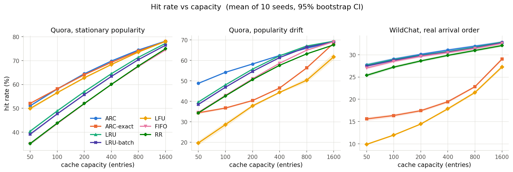

**Figure 1.** Hit rate vs capacity, three regimes, mean of 10 seeds, shaded 95% CI.

Capacity 100, mean of 10 seeds (full grid in Appendix B):

| Policy | Stationary | Drifting | Real prompts | **Worst case** |
|---|---|---|---|---|
| LRU (shipped default) | 48.87% | 48.05% | 28.90% | 28.90% |
| LRU-batch (shipped default, batch evict) | 47.63% | 46.92% | 28.74% | 28.74% |
| LFU | 56.53% | 28.68% | 11.96% | **11.96%** |
| FIFO | 43.56% | 42.94% | 28.50% | 28.50% |
| RR | 43.73% | 42.68% | 27.21% | 27.21% |
| ARC-exact *(ablation)* | 58.13% | 36.76% | 16.36% | 16.36% |
| **ARC (this work)** | **58.08%** | **54.21%** | **29.02%** | **29.02%** |

Read honestly: **LFU beats the shipped LRU default by 7.7 points on stationary traffic**, and ARC's
margin over LFU there is only ~1.5 points. The case for ARC is the **last column**. LFU's worst case
is 12%; ARC's is 29%. ARC is best in every column but never by a landslide — and it requires no
per-workload tuning to be in the right regime, which LFU catastrophically does.

## 4.3 The ablation

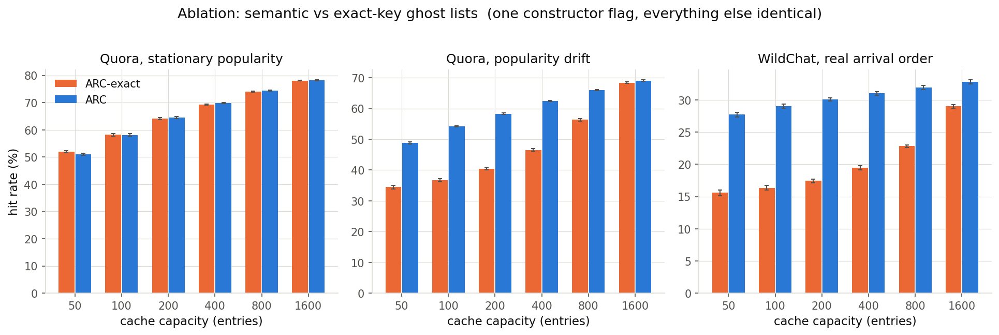
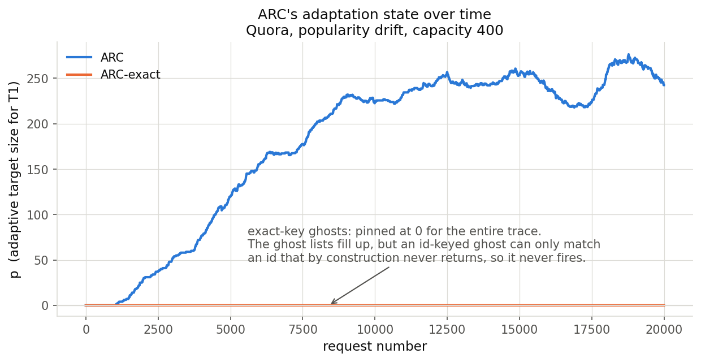

**Figure 2** (left). Semantic vs exact ghost matching. **Figure 3** (right). ARC's adaptation
parameter `p` over the trace.

`ARC-exact` is the same code with one flag flipped:

- On **stationary** traffic it is statistically indistinguishable from semantic ARC (58.13% vs
  58.08%) — with a fixed popularity ranking, ghosts rarely *need* to fire.
- On **drifting** traffic it collapses to 36.76% against 54.21% — a **17.5 pp** gap.
- On **real prompts** it collapses to 16.36% against 29.02% — a **12.7 pp** gap, and *below every
  other policy in the library except LFU*.
- Its `p` stays at exactly **0.000** for the entire trace, on every trace, on both cluster corpora
  including StackExchange which it was never tuned against.

Classic ARC on a semantic workload is not merely suboptimal; **its defining mechanism is inert**,
and inert ARC is worse than the LRU it was meant to improve on. This is P1, confirmed at scale.

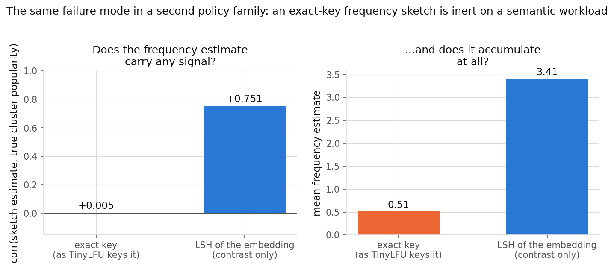

**Figure 4.** The same failure for frequency sketches (P2): exact-key estimates are uncorrelated with
true popularity (r = −0.037); LSH-keyed estimates track it (r = +0.931).

## 4.4 Answer correctness: false hit rate

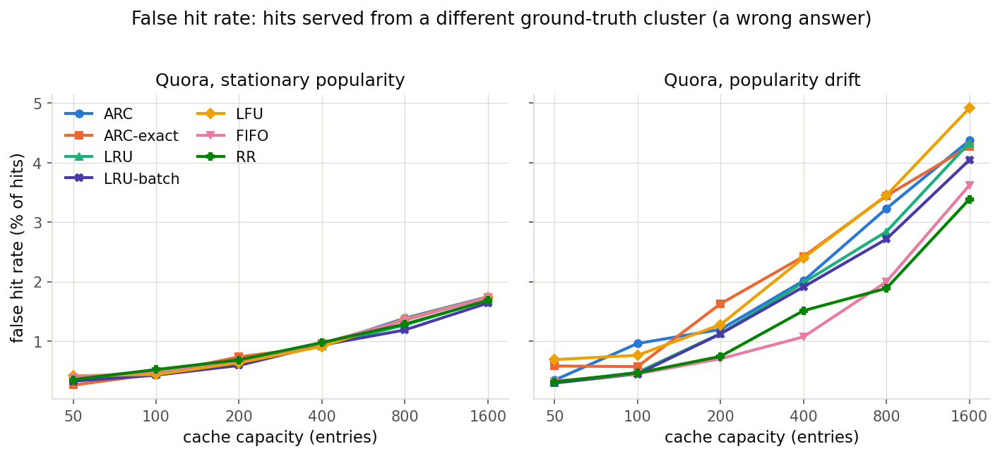

**Figure 5.** False hits as a fraction of hits served.

Reported because a semantic cache can be *wrong*, not just slow. At capacity 100 on stationary
traffic every policy sits at 0.43–0.52% — ARC 0.47%, LRU 0.45%: **no meaningful safety cost**. Under
drift ARC is elevated: **0.96% against LRU's 0.47%** (LFU 0.76%). The plausible mechanism is that
ARC's frequency bias retains once-popular entries longer, so the max-over-residents has more stale
candidates that can cross `tau` wrongly; this is a hypothesis consistent with LFU also being
elevated, not something this data isolates. Reported as measured. At capacity 400 the whole field
rises together (ARC 2.01%, LRU 1.98%) — larger caches mean more candidates and more chances to be
wrong, for every policy.

## 4.5 When does ARC actually beat LRU?

§4.2 establishes the worst-case claim but cannot say *what property of a workload* decides the
winner, because its two synthetic regimes are the endpoints of an axis with nothing sampled between
them. `benchmarks/sweep_crossover.py` fills it in: **5,520 cells** = 2 cluster corpora × 9 drift
rates × 5 skews × 6 capacities × 4 policies × 5 seeds, plus the real traces and a control.

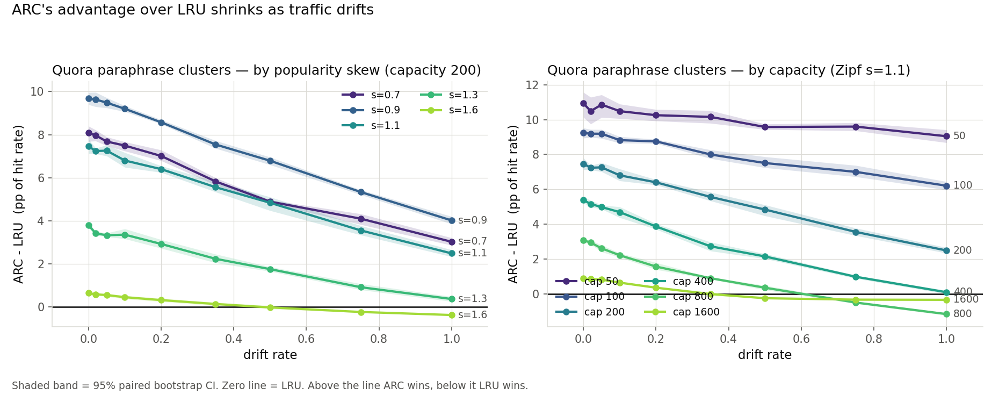

**Figure 6.** ARC − LRU as drift rises, by capacity.

ARC − LRU on Quora at Zipf s=1.1, percentage points (**bold** = 95% paired-bootstrap CI excludes
zero):

| capacity | δ=0 | δ=0.2 | δ=0.5 | δ=1.0 |
|---|---|---|---|---|
| 50 | **+10.93** | **+10.25** | **+9.58** | **+9.05** |
| 100 | **+9.23** | **+8.75** | **+7.51** | **+6.21** |
| 200 | **+7.46** | **+6.40** | **+4.84** | **+2.49** |
| 400 | **+5.38** | **+3.87** | **+2.15** | +0.10 |
| 800 | **+3.08** | **+1.57** | **+0.35** | **−1.16** |
| 1600 | **+0.88** | **+0.36** | **−0.25** | **−0.34** |

Two readings, and the second is the surprise:

1. The margin falls monotonically as **capacity** grows. This is the dominant effect.
2. The margin *also* falls as **drift** rises. **ARC's advantage over LRU is largest on stationary
   traffic** — the opposite of the intuition that ARC is "for" drift.

ARC loses only in the corner where capacity is large *and* drift is heavy. The same surface with the
same signs reproduces on StackExchange (+13.07 at capacity 50 / δ=0 → −1.67 at capacity 1600 / δ=1),
so this is a property of the traffic model, not of Quora.

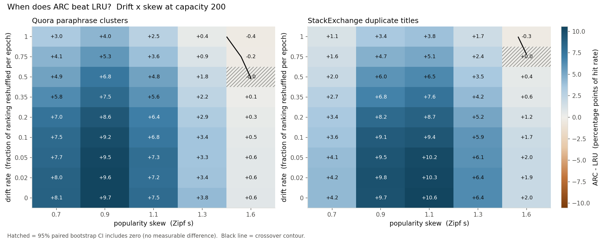
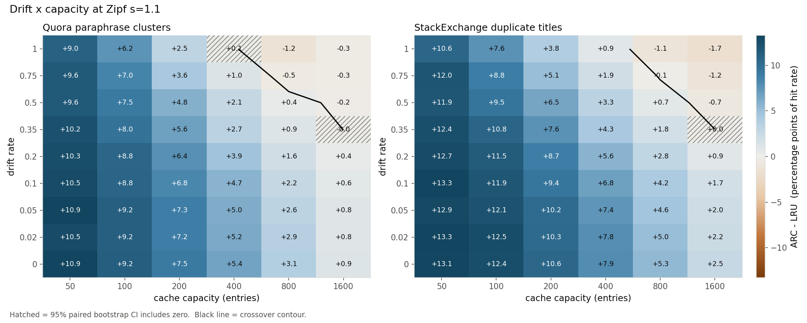

**Figures 7–8.** The full drift × skew and drift × capacity surfaces. Skew matters
non-monotonically: the advantage peaks around s ≈ 0.9–1.1 and collapses at s=1.6, where a handful of
clusters carry everything and *any* policy keeps them.

**Why the drift result is not a contradiction.** ARC's own state explains it. `p` is the target size
of the recency list `T1`: low `p` means ARC is leaning on frequency, high `p` means it is behaving
like LRU. As a fraction of capacity, on Quora:

| | δ=0 | δ=0.5 | δ=1.0 |
|---|---|---|---|
| capacity 200 | 4.5% | 14.0% | 35.9% |
| capacity 400 | 5.7% | 25.6% | 44.9% |

At zero drift ARC runs almost pure frequency, and **that frequency component is where its win over
LRU comes from**. As drift rises the ghosts correctly report that the frequency bet is failing, `p`
climbs, and ARC converges *toward* LRU — so its margin over LRU converges toward zero at the same
time.

**The adaptation is insurance against collapse, not a source of gain.** That is the right shape for
a default, but the honest pitch is "never much worse, often much better", not "handles drift better
than LRU". What the adaptation buys is visible against the policies that lack it — capacity 100,
drifting trace: LFU 28.68%, exact-ghost ARC 36.76%, LRU 48.05%, **semantic ARC 54.21%**.

## 4.6 Real arrival order

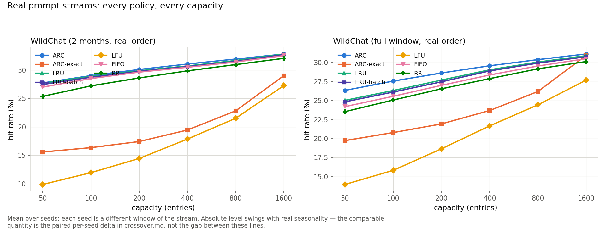

**Figure 9.** WildChat, real timestamp order.

| capacity | WildChat (2 months) | WildChat (12.5 months) |
|---|---|---|
| 50 | **+0.06** | **+1.31** |
| 100 | **+0.12** | **+1.25** |
| 400 | **+0.34** | **+0.53** |
| 1600 | −0.01 | **+0.23** |

Statistically significant, practically **about a point at most**. Meanwhile LFU is **10–18 points
behind** on the same traces, and `ARC-exact` is **4–12 points behind**.

**The long/short comparison is confounded, and a control was run.** `wildchat-long` spans a year but
is subsampled to 150,000 rows, making it ~2.2× *sparser in time* as well as longer. Thinning the
two-month stream by the same factor, holding span fixed, recovers +0.20 to +0.76 pp on its own:

| capacity | stride 1 | stride 2 | stride 3 | stride 4 |
|---|---|---|---|---|
| 50 | **+0.06** | **+0.20** | **+0.44** | **+0.51** |
| 100 | **+0.12** | **+0.43** | **+0.76** | **+0.85** |
| 400 | **+0.34** | **+0.30** | **+0.28** | **+0.43** |

Some of the long trace's larger margin is span, some is sparsity, and **this data cannot separate
them**.

## 4.7 Iso-memory: charging ARC for its ghosts

Everything above compares ARC(c) to LRU(c) **entry for entry**. That is the wrong comparison, and
correcting it changes the verdict.

ARC(c) holds `c` residents *plus up to `c` embedding-only ghosts*. The charge is **not** 2× — a
ghost is the 1536-byte embedding alone, while a resident also carries the question text and the
cached response. `benchmarks/measure_payload.py` measures the real distribution over all 71,637
WildChat entries: response mean 1531 B (median 1185 B), question mean 346 B, embedding 1536 B, so a
resident entry is **3,414 B** and the honest charge is **1.450×**. (The 2.0× figure corresponds to an
empty payload — which is exactly what the simulator holds, and what any entry-count plot implicitly
assumes.)

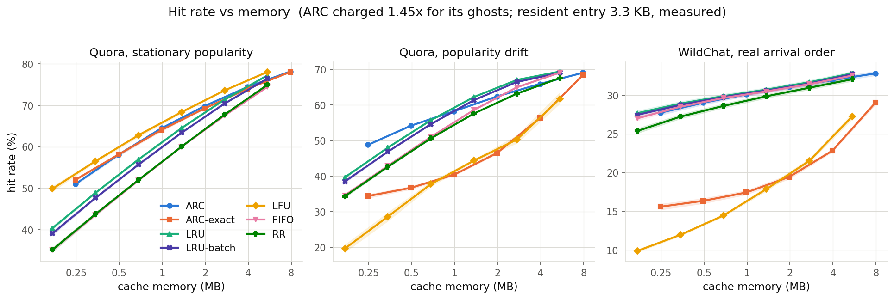

**Figure 10.** Hit rate vs **bytes**, with ARC charged 1.45× for its ghosts. Note the WildChat panel:
ARC's curve is no longer above LRU's.

ARC(c) minus LRU(charge × c), LRU interpolated log-linearly within each seed, 95% paired-bootstrap
CI. **Bold** = excludes zero. `–` = charge × c lands past the largest measured capacity.

**Quora, stationary**

| charge | c=50 | c=100 | c=200 | c=400 | c=800 |
|---|---|---|---|---|---|
| 1.00× (ghosts free) | **+10.64** | **+9.21** | **+7.53** | **+5.33** | **+3.06** |
| **1.45× (measured)** | **+6.08** | **+4.88** | **+3.48** | **+1.63** | −0.07 |
| 2.00× (empty payload) | **+2.13** | **+1.14** | −0.02 | **−1.56** | **−2.79** |

**Quora, drift**

| charge | c=50 | c=100 | c=200 | c=400 | c=800 |
|---|---|---|---|---|---|
| 1.00× | **+9.11** | **+6.16** | **+2.52** | **+0.16** | **−1.11** |
| **1.45×** | **+4.64** | **+2.03** | **−0.97** | **−2.41** | **−2.38** |
| 2.00× | **+0.76** | **−1.54** | **−3.99** | **−4.63** | **−3.48** |

**WildChat, real order**

| charge | c=50 | c=100 | c=200 | c=400 | c=800 |
|---|---|---|---|---|---|
| 1.00× | **+0.06** | **+0.12** | **+0.23** | **+0.34** | **+0.26** |
| **1.45×** | **−0.60** | **−0.40** | **−0.23** | **−0.17** | **−0.35** |
| 2.00× | **−1.18** | **−0.85** | **−0.62** | **−0.61** | **−0.89** |

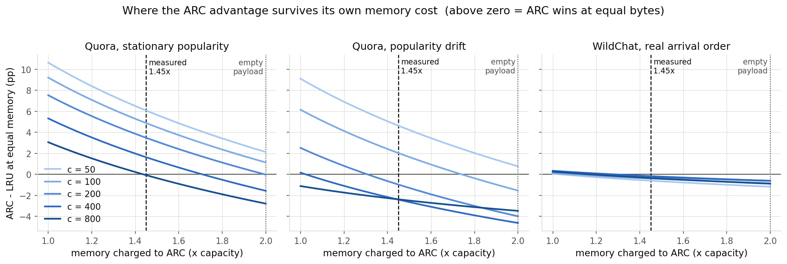

**Figure 11.** ARC − LRU at equal memory, as a function of the assumed ghost charge (1.0 → 2.0).
Above zero, ARC wins at equal bytes.

**This is the sharpest limit on the result, and it is the study's own finding:**

- On **stationary** synthetic traffic the win survives the real charge up to c ≈ 400–800.
- On **drifting** synthetic traffic it survives only to c ≈ 100.
- On **real prompt traffic it does not survive at any measured capacity.** At equal bytes, LRU is
  better on WildChat.

Because the charge depends on response length, Figure 11 sweeps it: the break-even is a *deployment
property*. A cache of long assistant responses (charge → 1.1×) keeps most of the ARC win; a cache of
short answers (charge → 2.0×) loses it. This is a knob a deployer can actually check.

## 4.8 Cost of the ghost scan

Capacity 400, drifting trace:

| | LRU | ARC |
|---|---|---|
| eviction decision | 3.37 µs/req | 11.51 µs/req |
| mean request (simulator) | 12.29 µs | 20.16 µs |
| p99 request (simulator) | 37.68 µs | 65.65 µs |
| throughput (simulator) | 75.7k qps | 47.0k qps |
| peak heap | 841 KB | 3,310 KB |
| policy vectors retained | 0 | 800 |

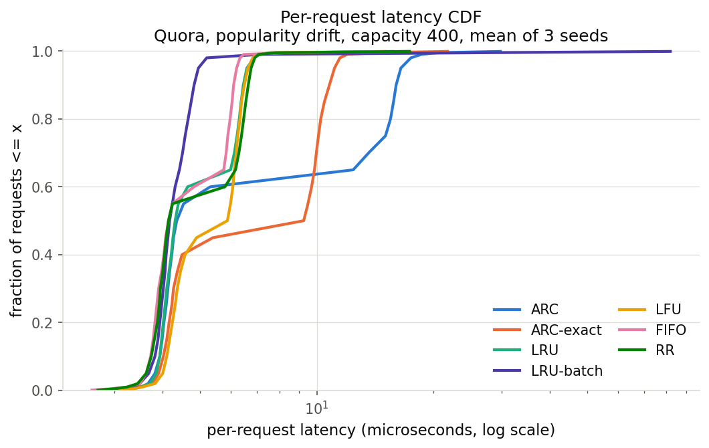

**Figure 12.** Per-request latency distribution (simulator level).

At capacity 1600 the heap gap is 3.3 MB vs 15.6 MB. **Time is the cheap axis**: these are
microseconds against an LLM call measured in hundreds of milliseconds, so converting one miss into a
hit repays the added scan thousands of times over. **Memory is the real constraint** — which is
exactly what §4.7 quantifies.

---

# 5. Discussion

## 5.1 What is actually established

The strongest result in this project is **not** "ARC beats LRU". It is the **diagnosis**: a whole
family of cache policies imported into semantic caching carries a hidden assumption — that the item
which returns is the item that left — and that assumption is false here. The evidence is unusually
clean because the failure has a *numeric signature*: `p ≡ 0.000`, everywhere, always. Two
independent mechanisms (ghost lists, frequency sketches) fail the same way for the same reason.

The fix is small and its effect is isolated by a one-flag ablation, present in every cell of every
sweep rather than in a bespoke experiment. That is the correctness argument for the mechanism claim.

## 5.2 The trade-off, stated plainly

| Axis | Verdict |
|---|---|
| Hit rate, entry-for-entry | ARC best worst-case across all three regimes, at every capacity ≤ 800. |
| Hit rate, **byte-for-byte** | Wins only where the cache is small relative to the working set; **loses on real prompt traffic at every measured capacity**. |
| Time | 3× the eviction-decision cost — irrelevant against an LLM call. |
| Memory | 1.45× per resident entry (measured); the binding constraint. |
| Answer correctness | Equal to LRU on stationary traffic; ~2× LRU's false-hit rate under heavy drift. |
| Operability | No knob to tune per workload — the main advantage over LFU, which is 17–20 pp worse than LRU in the wrong regime. |

## 5.3 The rule of thumb — and its documented failure

The crossover sweep produced a predictor: capacity relative to the **working set** (clusters covering
90% of traffic), which orders results better than drift does — r = **−0.71** against
log10(capacity / working set) vs **−0.36** against drift rate.

| capacity / working set | mean ARC − LRU | share of cells where ARC is significantly ahead |
|---|---|---|
| < 0.02 | +8.77 pp | 100% |
| 0.02 – 0.05 | +7.57 pp | 100% |
| 0.05 – 0.15 | +4.47 pp | 93% |
| 0.15 – 0.40 | +1.78 pp | 74% |

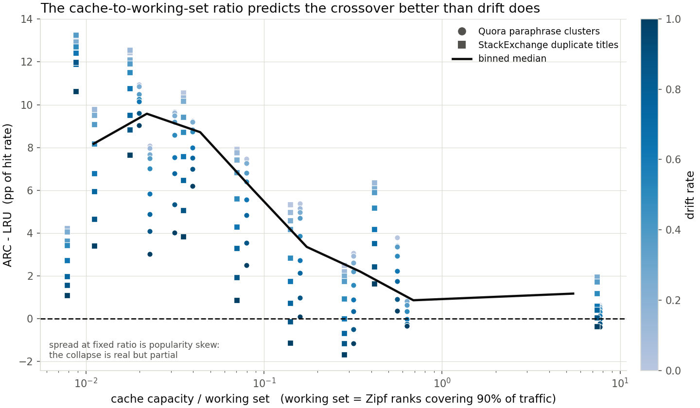

**Figure 13.** The collapse onto capacity / working set — on the synthetic cells it was fitted on.

**It does not transfer to real traffic.** `benchmarks/working_set.py` tests the rule against the two
traces with genuine arrival order, and it **over-predicts by 4.15 to 8.71 pp at every capacity of
both traces** (e.g. WildChat c=50: predicted +8.77, measured +0.06).

Three stages of that check are worth stating because they rule out the easy escape:

1. **The two definitions of "working set" genuinely differ** — analytic (Zipf ranks covering 90% of
   mass) vs empirical (distinct items covering 90% of arrivals) — by 0.37× to 5.78× on synthetic
   traces where both are computable. The analytic definition is drift-blind; the empirical one is
   censored by trace length. So the real traces cannot be placed on the rule's x-axis exactly.
2. **The gap is far larger than that uncertainty.** For the rule's *most pessimistic* bucket
   (+0.64 pp) to hold, the working set would have to be **7× to 224× smaller** than measured —
   against a definitional spread of at most 5.78×.
3. Therefore the conclusion does not rest on which definition is preferred: **the rule is a
   description of the synthetic sweep, not a law of semantic caches.**

This is reported as a negative result rather than quietly dropped, because the rule appears in the
user-facing documentation (`docs/eviction_policies.md`) and a deployer would otherwise be misled by
it.

## 5.4 Threats to validity

1. **No full GPTCache request path was benchmarked** (§3.1). Hit rates are sound; end-to-end latency
   claims are not available from this data.
2. **The large margins come from synthetic arrival orders.** Quora and StackExchange have no natural
   arrival order, so the Zipf popularity model and the drift model are invented. A total reshuffle
   every ~3,300 queries is aggressive and deliberately adversarial toward LFU. On the traces with
   genuine arrival order the entry-for-entry margin is ~1 pp, and byte-for-byte it is negative.
3. **Real-order traces have no paraphrase ground truth**, so false hit rate — the safety-relevant
   metric — is measurable only on synthetic-order traffic.
4. **The long/short real-trace comparison is confounded** with temporal density (§4.6); the control
   shows the confound is material.
5. **One embedding model.** Every result is conditional on MiniLM-L6-v2's similarity geometry, and
   ghost matching is *entirely* a function of that geometry.
6. **One `tau`.** Chosen principledly and documented, but not swept as a robustness axis in the
   crossover study.
7. **The working-set rule is a partial collapse that fails on real traffic** (§5.3).
8. **The iso-memory charge is measured on one corpus** (WildChat responses) and transferred to Quora,
   which has no assistant responses of its own. Figure 11 exists precisely because that number is a
   deployment property rather than a constant.

## 5.5 Practical guidance

Use ARC when the cache is **small relative to the working set**, responses are **long** (so the ghost
surcharge is small), and the traffic regime is **unknown or shifting** — the case where LFU's 17–20
pp downside risk is unacceptable. Keep LRU when the cache is large, responses are short, or memory
is the binding budget. Never use classic (exact-ghost) ARC on a semantic cache: it is worse than
every policy in the library except LFU.

---

# 6. Conclusion and future work

1. **The hypothesis holds.** Exact-key history is inert on semantic workloads — demonstrated twice,
   independently: frequency sketches at r = −0.037, and ARC ghosts at `p ≡ 0.000` across every trace
   and both cluster corpora. Semantic keying revives it, and the revival is worth up to 17.5 pp of
   hit rate against the identical code with the flag flipped.
2. **The mechanism is understood, not merely observed.** ARC's advantage over LRU is its *frequency*
   component; the semantic ghosts exist to detect when the frequency bet stops paying and retreat
   toward LRU. `p` traces this directly, and it explains the counter-intuitive finding that ARC's
   margin is *largest* on stationary traffic.
3. **Entry-for-entry, the practical claim is robustness** — best worst case across all three regimes
   with no per-workload knob, not the best policy in any single regime.
4. **Byte-for-byte, the claim is bounded.** Charged its measured 1.45× memory cost, ARC wins where
   the cache is small (stationary synthetic to c ≈ 400–800, drifting to c ≈ 100) and **loses on real
   prompt traffic at every measured capacity**. This limit was found by this study, not around it.
5. **A predictive rule fitted on synthetic traffic failed to transfer to real traffic**, by a margin
   too large for any definitional correction to close.

The most useful thing here for the GPTCache project is probably not the policy but the finding
underneath it: *if you are porting a replacement policy into a semantic cache, check whether its
history mechanism can ever fire.* `p ≡ 0.000` is a one-line diagnostic for the whole family.

**Future work**, in the order the evidence demands it:

- **Close the end-to-end gap.** Replay ~5k WildChat prompts through a real `Cache` +
  `SSDataManager` + FAISS + ONNX under LRU and ARC; report real hit rate and real p99. The test
  suite already builds this stack, so it is mostly wiring.
- **Attack the memory cost directly**, since §4.7 shows it is what binds. Ghosts do not need full
  384-d float32 vectors: product quantisation, random projection to 64-d, or a bounded ghost budget
  (`|B| = k·c`, k < 1) would each shift the charge toward 1.0 and, per Figure 11, restore the win on
  real traffic. This is the single highest-value follow-up.
- **The LSH-keyed sketch.** Gate 1 shows the signal is there (r = +0.931) but no policy was built on
  it. A semantically-keyed W-TinyLFU admission filter is the natural companion result.
- **Break the span/sparsity confound** by rebuilding `wildchat-long` at full density.
- **Second embedding model**, and **`tau` as a third sweep axis**, to test how much of this is
  MiniLM's geometry.

---

# Appendix A — artifacts and reproduction

## A.1 File map

**Policy**
- `gptcache/manager/eviction/arc.py` — `ARCCache` and `_VecList` (477 lines)
- `gptcache/manager/eviction/base.py`, `memory_cache.py`, `factory.py`,
  `gptcache/manager/data_manager.py` — integration (4 backward-compatible edits)

**Tests**
- `tests/unit_tests/eviction/test_arc_cache.py` — 26 tests
- `tests/unit_tests/manager/test_eviction.py` — +1 parametrised ARC case

**Data & benchmarks**
- `benchmarks/prepare_data.py` — Quora, WildChat, `tau` selection
- `benchmarks/prepare_data_ext.py` — StackExchange, WildChat-long
- `benchmarks/traces.py` / `traces_param.py` — fixed regimes / parameterised drift × skew
- `benchmarks/simcache.py` — semantic-cache front-end over the real policy objects
- `benchmarks/gate_screening.py` — the pre-implementation gate
- `benchmarks/run_bench.py` / `analyze.py` — main sweep, Figures 1–5, 10–12
- `benchmarks/sweep_crossover.py` / `analyze_crossover.py` — crossover study, Figures 6–9, 13
- `benchmarks/measure_payload.py` — the iso-memory charge
- `benchmarks/working_set.py` — the working-set rule transfer check

**Results** — `benchmarks/results/`: `summary.md`, `summary.csv`, `crossover.md`, `working_set.md`,
`payload.json`, `gate_screening.txt`, `baseline_tests.txt`, `bench.csv`, `crossover_*.csv`,
`lat_cdf.csv`, `p_trace.csv`, `fig1`–`fig13`

**Docs** — `docs/eviction_policies.md` (user-facing policy selection guide),
`benchmarks/README.md` (how to benchmark), this report

## A.2 Reproducing

```bash
python -m venv .venv && source .venv/bin/activate
pip install -e . && pip install -r benchmarks/requirements.txt

# corpora (~30 min, ~4 GB download, once)
python benchmarks/prepare_data.py
python benchmarks/prepare_data_ext.py

python benchmarks/gate_screening.py     # the pre-implementation gate
python benchmarks/measure_payload.py    # iso-memory charge -> payload.json
python benchmarks/run_bench.py          # main sweep       (~90 s)
python benchmarks/analyze.py            # figs 1-6, 12-13, summary.md
python benchmarks/sweep_crossover.py    # 5,520 cells      (~2.5 min, 12 cores)
python benchmarks/analyze_crossover.py  # figs 7-11, crossover.md
python benchmarks/working_set.py        # rule transfer check -> working_set.md

python -m pytest tests/unit_tests/eviction/ tests/unit_tests/manager/ -q
```

A pinned `Dockerfile` is in `benchmarks/`. Reference hardware for the committed numbers: MacBook Pro,
Apple M-series, 24 GB, macOS 26.4, Python 3.10.11, numpy 2.2.6. Hit rates are bit-for-bit
reproducible (§3.7); latency, throughput and heap are hardware-dependent.

# Appendix B — full result tables

Complete grids, all six capacities, all seven policy arms, with 95% paired-bootstrap CIs:

- `benchmarks/results/summary.md` — the three fixed regimes, worst-case table, iso-memory tables,
  cost table
- `benchmarks/results/crossover.md` — drift × skew and drift × capacity surfaces for both cluster
  corpora, working-set bucketing, real traces, thinning control
- `benchmarks/results/working_set.md` — the three-stage rule-transfer check
- `benchmarks/results/summary.csv` — every metric of every cell, machine-readable
- `benchmarks/results/gate_screening.txt` — the pre-implementation gate output
- `benchmarks/results/baseline_tests.txt` — the before/after regression record

# References

Nimrod Megiddo and Dharmendra S. Modha. *ARC: A Self-Tuning, Low Overhead Replacement Cache.*
USENIX FAST 2003.

Gil Einziger and Roy Friedman. *TinyLFU: A Highly Efficient Cache Admission Policy.* PDP 2014.
Extended: Einziger, Friedman & Manes, ACM TOS 2017.

**Datasets:** Quora Question Pairs (via `sentence-transformers/quora-duplicates`);
`sentence-transformers/stackexchange-duplicates`; `allenai/WildChat-1M`.
**Embeddings:** `sentence-transformers/all-MiniLM-L6-v2`.
