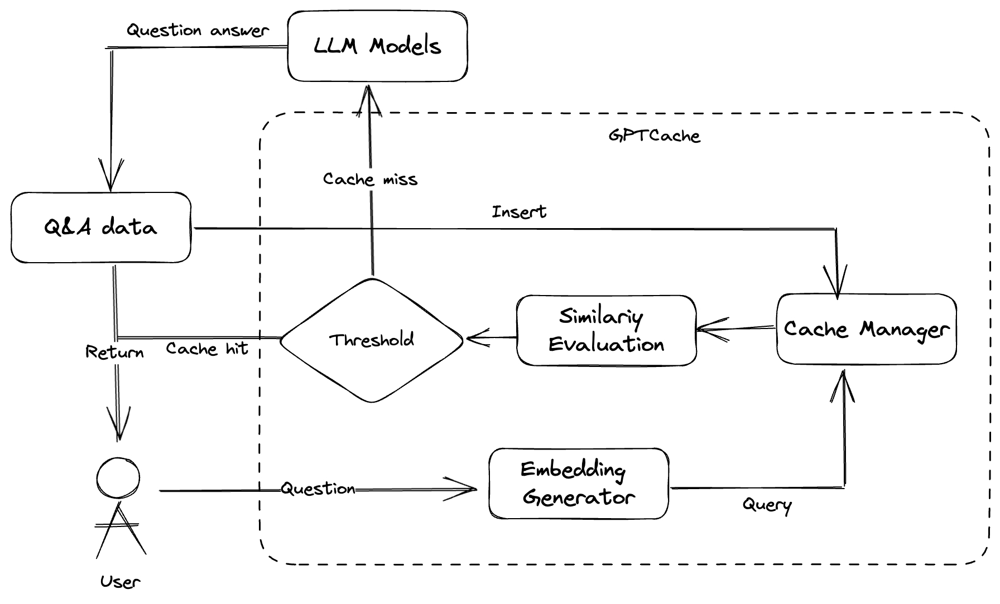

# 👾 System Design

## 🧐 System flow

The core process of the system is shown in the diagram above:

1. The user sends a question to the system, which first processes the question by converting it to a vector and querying it in the vector database using the Encoder modules to embed.
2. After passing through the ranker module, the query result will be assigned a rank score.
3. If the rank score obtained surpasses the threshold, the query result is returned to the user; otherwise, the system proceeds to the next step.
4. The user request is forwarded to the LLM models, which returns the data and sends it to the user.
5. At the same time, the question-answer data is inserted into the cache manager for fast response to future user queries.

## 😵‍💫 System Core

1. How to perform **embedding** operations on cached data
This part involves two issues: the source of initialization data and the time-consuming data conversion process.
- For different scenarios, the data can be vastly different. If the same data source is used, the hit rate of the cache will be greatly reduced. There are two possible solutions: collecting data before using the cache, or inserting data into the cache system for embedding training during the system's initialization phase.
- The time required for data conversion is also an important indicator. If the cache is hit, the overall time should be lower than the inference time of a large-scale model. Otherwise, the system will lose some advantages and reduce user experience.
2. How to **manage** cached data
The core process of managing cached data includes data writing, searching, and cleaning. This requires the system being integrated to have the ability of incremental indexing, such as Milvus, and lightweight HNSW index can also meet the requirements. Data cleaning can ensure that the cached data will not increase indefinitely, while also ensuring the efficiency of cache queries.
3. How to **evaluate** cached results
After obtaining the corresponding result list from the cache, the model needs to perform question-and-answer similarity matching on the results. If the similarity reaches a certain threshold, the answer will be returned directly to the user. Otherwise, the request will be forwarded to LLM models.

## 🤩 System Structure

- **Adapter**: The user interface to adapt different LLM model requests to the GPTCache protocol, like: OpenAI chatGPT API or Hugging Face Hub, Anthropic, and self-hosted models like LLaMa.
- **Pre-processor**: Extracts the key information from the request and preprocess, like: basic analysis and parse of the request.
- **Encoder**: Embed the text into a dense vector for similarity search, like: Use [ONNX](https://onnx.ai/) with the GPTCache/paraphrase-albert-onnx model for English text embedding.
- **Cache manager**: which includes searching, saving, or evicting data. It includes a database of scalar data and a database of vector data. The scalar data is historical question and answer data of the user, that is, historical question data and historical answer data, which is readable. The vector data is an array or others obtained by the process of the Encoder module, which is used for similarity search and is not commonly readable. The Cache Manage module performs a similarity search in the database of the vector data according to the vector data of the user's request, and obtains the result of the similarity search.
- **Ranker**: Evaluate similarity by judging the quality of cached answers, like: the search distance, we provide a GPTCache/albert-duplicate-onnx model for precise comparison between questions and answers.
- **Post-processor**: Determine which cached answers to the user, and generate the response, like: the most similar answer, random.